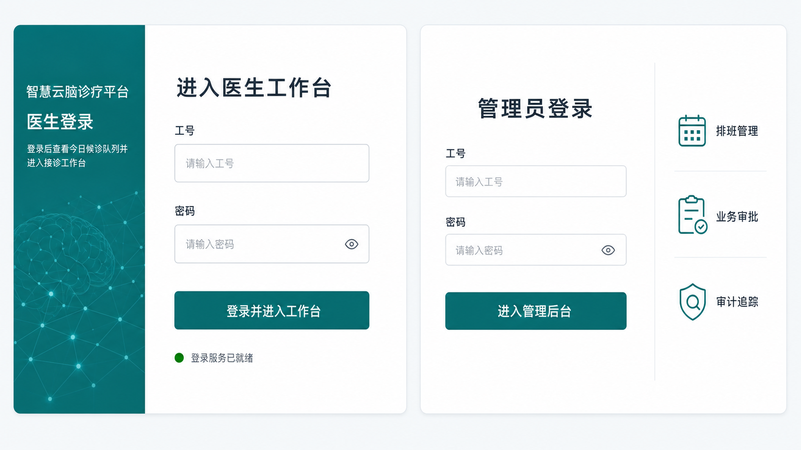

# 医生与管理员登录页改造计划

更新时间：2026-07-15

## Goal

将医生端从“选择科室和医生后进入工作台”的演示入口，改为与管理员端一致的账号密码登录；同时重做两个登录页的首屏体验，使其成为同一套医疗工作台产品的可信入口。

## Current behavior

- 医生登录页通过科室和医生下拉选择建立本地会话，不能表达真实账号登录。
- 管理员端已经提供工号与密码表单，但页面在大屏上内容偏左、留白过多，且与医生端缺少统一登录体验。
- 两页都缺少完整的 loading、字段错误、服务不可用和空数据说明。

## Design direction

- **产品语气**：可靠、清晰、克制；不使用海报式大字、渐变 Hero 或与任务无关的装饰。
- **桌面布局**：最大内容宽度约 1120px，采用“品牌/职责说明 + 登录任务区”双栏；表单是视觉主角。
- **视觉语言**：冷白背景、深青绿主操作色、细边框、轻阴影、14px 圆角；输入与按钮高度不低于 44px。
- **响应式**：小于 768px 改为单栏，仅保留必要的品牌说明和登录表单，主按钮在首屏可见。

## Proposed solution

### 1. 医生账号密码登录

1. 新增医生登录契约：`POST /api/v1/auth/doctor/login`。
   - 输入：`staff_code`、`password`。
   - 成功返回：医生 UUID、姓名、所属科室及可用于建立医生会话的登录结果。
   - 失败统一返回可展示的凭据错误；不得通过文案区分“账号不存在”和“密码错误”。
2. `DoctorLoginView.vue` 改为工号、密码两个字段，删除科室与医生选择器。
3. `doctorSession.ts` 只在登录成功后写入医生身份与科室上下文；保留现有 `/doctor/workbench` 跳转目标。
4. 目录接口可保留给管理员维护和医生信息展示，但不再承担医生身份选择。

### 2. 医生登录页布局

- 左栏：平台名、`医生登录`、一句任务说明“登录后查看今日候诊队列并进入接诊工作台”，配低对比度神经网络线条纹理。
- 右栏：标题“进入医生工作台”、工号输入、密码输入、主按钮“登录并进入工作台”。
- 表单下方只显示真实状态：提交中、账号或密码错误、服务暂不可用；不再显示开发阶段说明或未经过健康检查验证的“服务就绪”。

### 3. 管理员登录页布局

- 主栏：居中的账号密码表单，标题“管理员登录”，主按钮“进入管理后台”。
- 辅栏：用三个简洁图标说明后台职责：排班管理、业务审批、审计追踪；它只提供语境，不抢占表单注意力。
- 保持既有管理员登录接口和会话结果，重做布局、字段反馈与响应式表现。

## States and copy

| 状态 | 医生端 | 管理员端 |
| --- | --- | --- |
| 初始 | 输入工号和密码后登录 | 输入工号和密码后登录 |
| 字段缺失 | 请填写工号 / 请填写密码 | 请填写工号 / 请填写密码 |
| 凭据错误 | 工号或密码不正确，请重新输入 | 工号或密码不正确，请重新输入 |
| 提交中 | 正在登录…，按钮禁用 | 正在登录…，按钮禁用 |
| 服务失败 | 登录服务暂不可用，请稍后重试 | 登录服务暂不可用，请稍后重试 |

## Implementation order

1. 确认医生账号、密码哈希和启用状态所在的数据模型，并实现医生登录接口与测试。
2. 调整 `doctorSession.ts`、路由守卫和 `DoctorLoginView.vue`，移除“目录选择即登录”的旧流程。
3. 抽取 `StaffLoginShell` 或共用样式层，供医生和管理员登录页复用。
4. 重构 `AdminLoginView.vue`，保留其现有 API 调用，仅替换布局与状态反馈。
5. 做桌面、平板、手机三档视觉回归，并补充两个登录流的浏览器测试。

## Risks

- 现有演示数据必须提供可用的医生账号和初始密码，否则新页面会出现“界面完成但无法登录”的断链。
- 医生登录改为密码校验后，原先仅依赖目录数据的浏览器测试和演示脚本需要同步更新。
- 本轮不重做医生工作台或管理员后台的信息架构，只调整登录链路和登录页体验。

## Validation strategy

- 后端：医生正确密码成功、错误密码失败、停用医生不可登录、返回字段完整。
- 前端：`pnpm build` 通过；医生和管理员登录成功后分别到达 `/doctor/workbench`、`/admin/dashboard`。
- 视觉：1440px、1024px、390px 下无横向滚动；主按钮首屏可见；焦点、禁用、错误和加载状态清晰可辨。

## Acceptance criteria

- 医生不再通过选择姓名进入工作台，必须输入账号和密码。
- 两个登录页具有统一的组件、间距和状态反馈语言，但医生与管理员的职责语境仍可区分。
- 登录页不出现开发阶段文案、伪造业务数据或与登录无关的大面积装饰。
