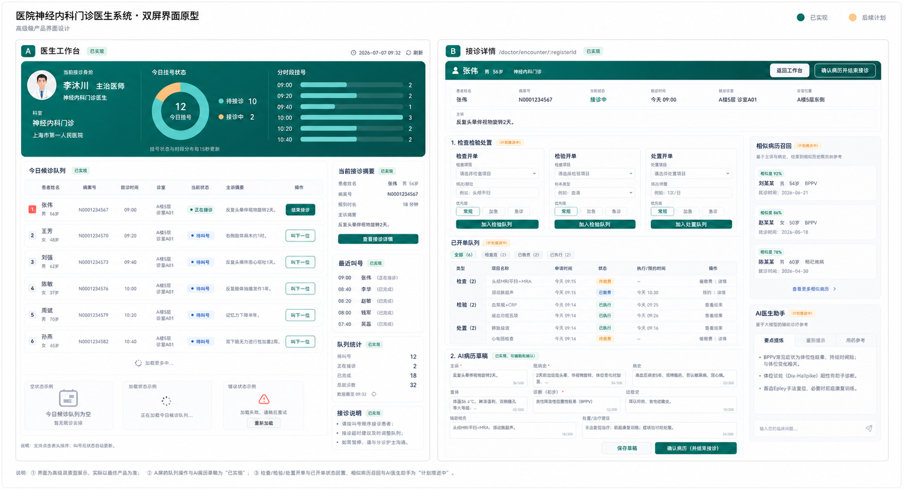
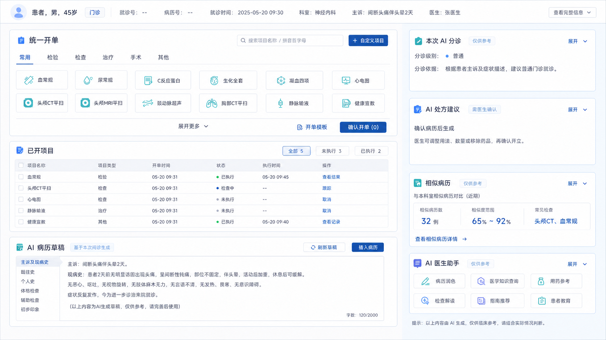

# 前端实施计划

更新时间：2026-07-10。

本文档是前端路由、会话、页面状态和执行切片的唯一来源。总体业务优先级见 [项目规划.md](./项目规划.md)。

## 1. 前端方向

- 维持一个 `frontend/` 工程，不拆成三个仓库。
- 根路由 `/` 只负责三端入口分流。
- 患者端首页优先，医生端和管理员端登录优先。
- 三端使用独立 layout、session store 和路由守卫，不再使用全局角色切换器。
- 患者端移动优先；医生端和管理员端使用桌面工作台 / 后台布局。
- 只展示真实接口或明确的加载、空、错误状态，不用静态假业务掩盖接口缺口。

## 2. 当前路由

### 2.1 入口

| 路由 | 用途 |
| --- | --- |
| `/` | 三端入口页 |
| `/patient` | 重定向患者首页 |
| `/doctor` | 重定向医生登录 |
| `/admin` | 重定向管理员登录 |

### 2.2 患者端

| 路由 | 状态 |
| --- | --- |
| `/patient/home` | 首页，公开 |
| `/patient/hospital` | 医院信息概念展示页，公开 |
| `/patient/login` | 登录 |
| `/patient/register` | 注册建档 |
| `/patient/departments` | 选科，需登录 |
| `/patient/triage` | AI 分诊，需登录 |
| `/patient/doctors` | 医生推荐，需登录 |
| `/patient/confirm-register` | 确认挂号，需登录 |
| `/patient/payment` | 模拟支付，需登录 |
| `/patient/payments` | 缴费中心：检查、检验、处置与后续药品的缴费入口，需登录 |
| `/patient/queue` | 候诊状态，需登录 |
| `/patient/registers` | 历史挂号，需登录 |
| `/patient/profile` | 个人中心，需登录 |
| `/patient/messages` | 静态通知中心，需登录；当前不接入消息接口 |

### 2.3 医生端

| 路由 | 状态 |
| --- | --- |
| `/doctor/login` | 真实医生目录登录 |
| `/doctor/workbench` | 真实候诊工作台，需登录 |
| `/doctor/encounter/:registerId` | 接诊详情，需登录 |

### 2.4 管理员端

| 路由 | 状态 |
| --- | --- |
| `/admin/login` | 演示登录 |
| `/admin/console` | 控制台骨架，需登录 |

## 3. 会话与状态

| Store | 职责 |
| --- | --- |
| `patientSession.ts` | 患者身份 |
| `doctorSession.ts` | 医生身份和科室 |
| `adminSession.ts` | 管理员演示身份 |
| `patientFlow.ts` | 单次挂号流程、AI 分诊会话和选科结果 |
| `patientRegisterHistory.ts` | 本地待合并的挂号历史共享缓存 |

`router/sessionGuard.ts` 统一处理三端登录态。业务页面应直接读取本端 session，不把身份重新塞回全局 app store。

本地待合并的挂号历史缓存策略：

- `sessionStorage` 持久化。
- 60 秒 TTL。
- 同一患者并发请求复用 in-flight Promise。
- 新挂号和支付成功后主动失效。

## 4. 当前页面能力

### 4.1 患者端

缴费中心专项计划见 [patient-payment-center-plan.md](./patient-payment-center-plan.md)。首页“历史挂号”已替换为“缴费中心”，而“按科室挂号”与既有 `/patient/departments` 挂号路由保持不变；`/patient/payment` 挂号费支付页面也继续保留。

已完成真实主链：

```text
首页 -> 登录 / 注册 -> 选科或 AI 分诊 -> 医生推荐
-> 号源确认 -> 支付 -> 候诊状态 / 历史挂号 / 个人中心
```

交互规则：

- AI 分诊是挂号流程中的可选辅助，不作为首页孤立入口。
- 患者端不展示内部科室编码、排班 ID 或接口来源说明。
- AI 输出必须显示来源和边界；未配置真实模型时显示不可用或明确 fallback。
- 挂号到支付链路使用共享头部，保留返回上一步和回首页能力。
- `/patient/queue` 只展示当前进行中的候诊状态：从本次支付或本地挂号历史恢复候诊单，每 15 秒同步候诊进度，并保留手动刷新、加载失败提示、诊室信息与多张进行中挂号单切换；头部返回操作固定回到 `/patient/home`。
- `/patient/registers` 只展示全部历史挂号记录；支付完成后直接打开 `/patient/queue`。首页和个人中心分别提供“候诊状态”与“挂号记录”两个独立入口。
- 已新增 `/patient/visit-code` 概念展示页：受现有登录守卫保护，使用非敏感固定字符串生成可识别二维码并展示患者姓名和门诊号；不接入扫码或服务端核验。
- 已新增 `/patient/messages` 静态通知中心：展示挂号、候诊和检查报告三类示意通知；不提供即时聊天、消息推送、已读回写或后端接口调用。
- 已完成患者端医院信息页的高保真概念设计与页面实施，专项计划见 [patient-hospital-info-plan.md](./patient-hospital-info-plan.md)。首页“医院信息”进入公开路由 `/patient/hospital`；该页仅做概念展示，不将示意院区资料伪装为真实接口数据，路线入口明确提示服务暂未接入。

### 4.2 医生工作台



当前已完成：

- 从 `GET /api/v1/patient/doctor/{employee_uuid}/queue` 读取今日队列。
- 叫下一位、开始接诊、继续接诊。
- 顶部三栏：医生身份、挂号状态环图、分时段挂号条形图。
- 状态和时段数据都由同一队列数组计算，不新增图表依赖。
- 缺失时段归入“时间待确认”，超过 6 行时合并其他时段。
- 15 秒轮询、手动刷新、最后更新时间、首次加载和失败状态。
- 切换医生时丢弃过期请求，避免显示上一位医生的数据。
- 1280px 和 430px 已完成无横向溢出验证。
- 右侧支持区使用中文优先字体栈，并区分 20px 卡片标题、14px 说明、13px 字段标签、16px 字段值和 15px 操作约束；摘要改为标签 / 值对齐的信息行，避免嵌套卡片与粗细混杂。

当前验证边界：本地 8 位医生今日队列均为空，真实非空状态分布和条形长度仍需在出现当日挂号后补验。

### 4.3 医生接诊页

#### 布局蓝图



这张图是接诊页下一轮视觉调整的布局依据，不代表所有画面中的示例数据或辅助功能都已上线。实现时遵循以下边界：

- 左侧为医生工作区：统一开单、已开项目、AI 病历草稿，医生在这里完成诊疗和签署动作。
- 右侧为 AI 支持区：本次 AI 分诊、AI 处方建议、相似病历和 AI 医生助手；各卡片均为辅助信息，不替代医生确认。
- AI 处方建议仅在病历确认后生成，医生可调整用法、数量或移除药品，再明确确认开立；AI 检查检验建议仍是后续计划，当前不自动创建订单。
- 窄屏时先纵向展示左侧医生工作区，再展示右侧 AI 支持区，保证操作优先级不变。

已完成：

- 挂号与患者摘要。
- AI 病历草稿读取和医生确认。
- 相似病历召回和 AI 医生助手。
- 检查、检验、处置开单和已开项目状态回看。
- 15 秒刷新已开项目与相关状态。

统一开单专项（第一阶段已实现）：

- 医生端已将检查、检验、处置的**操作入口与签署动作**合并为一个“医疗项目”搜索框、一张待签清单和一个确认签署按钮；项目类型、收费、执行、结果回传和审计仍保持分链路处理。
- 该改造只替换接诊页左侧主工作区当前的三张开单卡片，保留左侧导航、深青绿 Hero、患者摘要、右侧支持栏、`SectionCard` 视觉语言和现有已开项目状态回看位置。
- 后端已提供 `POST /api/v1/medical/orders/sign`，对混合项目进行类型校验后在本地事务中统一创建；前端签署期间会锁定清单，网络超时的持久化幂等与检验/处置下游派发可观测性仍待后续硬化。
- 完整的交互、接口、事务、幂等、视觉约束与验证策略见 [统一医嘱入口计划](./unified-medical-order-plan.md)。

AI 辅助与布局（已完成 / 待验证）：

- 已只读展示本次 AI 分诊摘要、性别年龄快照和关键问答，不自动改写病历或诊断。
- 已接入处方建议：仅在病历确认后按需生成，医生可调整用法、数量或移除药品，再明确确认开立正式处方。
- 接诊页左侧固定为医生工作区，右侧集中展示 AI 分诊、AI 处方建议、相似病历和 AI 医生助手；窄屏时按工作区优先、AI 支持区随后顺序纵向排列。
- 当前处方页面没有“手工补药”入口；本轮不扩大为完整处方编辑器，也不把 AI 建议自动写入正式处方。
- 已规划 AI 检查检验建议：基于病历、AI 分诊上下文和已开项目给出候选项目与理由；医生选择、删除或调整后，仍复用统一开单待签清单和确认签署动作。

### 4.4 管理员端

当前已具备独立入口、演示 session、控制台总览和一组最小可运行后台页面。已落地内容包括：

- 管理员端专用 API 封装，已覆盖排班、审批、AI 审计、药房和账单。
- 路由与页面：`/admin/schedules`、`/admin/approvals`、`/admin/audit`、`/admin/pharmacy`、`/admin/billing`、`/admin/doctors`、`/admin/departments`、`/admin/rooms`、`/admin/analytics`。
- `AdminLayout` 已升级为后台壳，提供管理员导航、会话信息和退出入口。
- `AdminConsoleView` 已从占位骨架升级为可读取真实审批和审计数据的总览页。
- 医生、科室、诊室和运营分析页面已具备最小可运行闭环，并与 [管理员端功能规划](./管理员端功能规划.md) 的页面结构保持一致。

当前边界：

- 管理员登录仍是演示态，不是正式鉴权闭环。
- 已有页面以“最小可运行和可构建”为先，仍未完成完整后台运营链路。

账号管理专项已规划，见 [管理员端账号管理强化计划](./admin-account-management-plan.md)。该专项会先建立真实管理员身份和账号接口授权，再按现有后台分页约定补齐医生/患者档案分页、错误状态、敏感信息脱敏、医生凭据生命周期与操作审计；患者档案不在此切片中改造成认证账号。

后续顺序固定为：

1. 真实管理员鉴权。
2. 科室、医生和排班基础管理。
3. 排班申请审批与规则干预。
4. AI 审计日志。

## 5. AI 上下文前端边界

本地待合并的前端已传递：

- `patient_uuid`
- `session_uuid`
- `triage_session_uuid`

后端挂号关联 `ai-context` 已由医生接诊页消费：

- `patientApi.getRegisterAIContext(registerUuid)` 读取本次分诊上下文。
- 接诊页只读展示分诊摘要、性别年龄快照、关键消息和来源信息。
- 无分诊记录显示紧凑空状态；读取失败可单独重试，不影响病历和开单主流程。
- AI 上下文不会自动覆盖医生输入，也不会直接写入诊断。

## 6. 执行顺序

### 已完成回归：医生端处方推荐浏览器回归（桌面）

交付结果：

- 已于 2026-07-15 使用本地演示挂号完成“确认病历 -> 生成建议 -> 调整数量 -> 医生确认开立”的桌面浏览器回归；AI 建议生成后未自动创建处方，医生确认后才创建正式处方。
- 已回查病历确认状态与处方明细：本次处方为 AI 推荐、共 1 项，前端调整后的数量为 2，与后端处方明细一致。
- 已验证桌面端左侧医生工作区、右侧 AI 支持区并列展示，且本次 AI 分诊上下文只读显示。
- 已于 2026-07-15 使用浏览器 viewport 在 `1024 x 768` 与 `390 x 844` 两档宽度复验已确认病历页：工作区均为单列，左侧医生工作区在右侧 AI 支持区之前，页面 `scrollWidth` 与 `clientWidth` 一致，未出现横向溢出。

### 当前切片：医生端浏览器回归脚本固化

交付标准：

- 已新增响应式静态回归，锁住工作区 DOM 顺序和 `1180px` 以下单列规则；已由 `1024 x 768` 与 `390 x 844` 实机浏览器复验补足静态检查边界。
- 已使用已确认病历样本复验“左侧工作区优先、右侧 AI 支持区随后”的纵向顺序，页面未横向溢出。
- 已在 `frontend/` 引入 Playwright 和 Chromium，`pnpm test:e2e` 已通过医生登录页只读冒烟测试；失败时保留 trace 和截图，当前尚未覆盖处方写操作。
- 已新增 `backend/scripts/create_doctor_prescription_e2e_fixture.py`：通过管理员 JWT 创建带 `E2E Prescription` 前缀的医生、患者、明日号源和已支付接诊中挂号，并等待病历草稿就绪后输出浏览器所需 UUID；脚本不确认病历、不请求处方建议、不创建处方。运行命令为 `cd backend && python scripts/create_doctor_prescription_e2e_fixture.py`，依赖本机 `.env` 的管理员初始化凭据与已启动微服务。
- 将已通过的“登录 -> 候诊 -> 接诊 -> 病历确认 -> 生成建议 -> 调整数量 -> 处方确认”链路固化为可重复执行的浏览器回归脚本。
- 脚本必须使用受控演示数据或可恢复数据，避免重复开立正式处方；桌面和窄屏均保留断言或截图证据。

### 后续切片

1. AI 检查检验建议：只返回检查、检验候选项目和理由，不自动创建订单；医生筛选后复用 `POST /api/v1/medical/orders/sign` 签署。
2. 非空医生队列可视化回归。
3. 管理员真实鉴权和排班管理。
4. 三端完整演示回归。

## 7. 验证清单

- `npm run build`。
- `/` 三端入口跳转正确。
- 患者 `/patient` 首页优先，受保护页面未登录时跳转 `/patient/login`。
- 医生和管理员未登录时跳转各自登录页。
- 登录后访问登录页会回到本端首页。
- 患者端在常见手机宽度无横向溢出。
- 医生工作台和接诊页在桌面、窄屏下可读可操作。
- loading / empty / error 不显示虚构业务数据。
- AI 来源、fallback 和医生确认边界清楚。

## 8. 维护规则

- 患者端页面宽度、桌面端外框阴影和外缘圆角统一由 `PatientLayout.vue` 维护；页面组件不得重复声明页面级 `max-width`、外框阴影或外缘圆角。页面内部卡片、头像和图标可按其内容语义保留圆角。
- 页面状态直接更新对应章节，不在文件末尾继续追加日期补丁。
- 完成执行切片后，将“当前切片”替换为下一项；过程、验收和问题留在对应历史文档，避免丢失报告证据。
- 专项设计完成后，当前结论并入本文档；仍有引用价值的设计资产保留在 `设计图留档.md` 或专项设计文档中。
