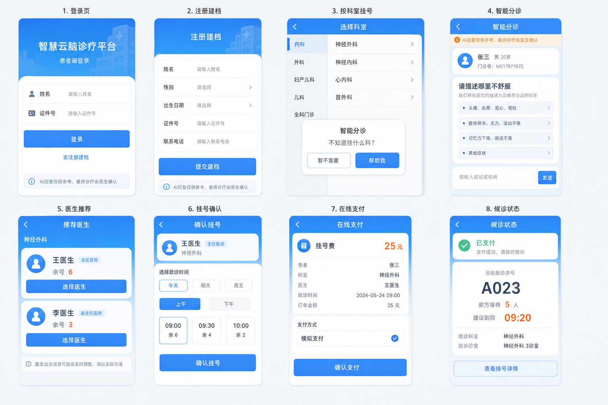

# 前端实施计划

本文档是智慧云脑诊疗平台的前端专项计划，用于记录前端结构、患者端主链路、设计规则、真实接口边界和阶段进度。总业务范围以 `docs/项目规划.md` 为准。

更新时间：2026-07-01。

## 1. 前端建设原则

- 只接真实后端接口，不写大面积本地假业务。
- 先完成患者端主链路，再推进医生端和管理员端。
- 患者端移动端优先，医生端和管理员端桌面端优先。
- 三端共用请求层、状态层、主题变量和基础组件，但业务页面风格要区分。
- 前端不暴露后端内部编码，例如科室代码 `SJWK` 只用于接口参数，患者界面展示“神经外科”。
- AI 结果必须标明来源，区分真实 LLM、规则、mock、fallback。
- 医生推荐、排班和号源选择必须来自真实医生、真实排班和真实号源。

## 2. 技术栈与目录

- Vue 3
- Vite
- Vue Router
- Pinia
- Axios
- Element Plus

```text
frontend/
  src/
    api/                统一接口调用
    stores/             Pinia 状态管理
    router/             路由配置
    layouts/            patient / doctor / admin 三套布局
    views/
      patient/          患者端页面
      doctor/           医生端页面
      admin/            管理员端页面
    components/
      common/           公共组件
      patient/          患者端组件
    styles/             全局样式与主题
```

## 3. 当前工程状态

已完成：

- Vue 3 + Vite 工程初始化。
- `Vue Router`、`Pinia`、`Axios`、`Element Plus` 接入。
- 三套基础布局已完成：
  - `frontend/src/layouts/PatientLayout.vue`
  - `frontend/src/layouts/DoctorLayout.vue`
  - `frontend/src/layouts/AdminLayout.vue`
- 全局角色切换按钮已提升到 `frontend/src/App.vue`，本轮暂不修改该按钮。
- 公共请求层：`frontend/src/api/http.ts`。
- 患者端接口层：`frontend/src/api/patient.ts`。
- 基础全局状态：`frontend/src/stores/app.ts`。
- 患者流程状态：`frontend/src/stores/patientFlow.ts`。
- 开发服务地址：`http://localhost:5173`。

## 4. 三端页面边界

### 4.1 患者端

定位：移动端优先，承担患者自助操作主链路。

当前页面：

- 登录页：`/patient`
- 注册建档页：`/patient/register`
- 患者端首页：`/patient/home`
- 挂号入口 / 选择病种页：`/patient/departments`
- AI 问诊页：`/patient/triage`
- 医生推荐页：`/patient/doctors`
- 挂号确认页：`/patient/confirm-register`
- 在线支付页：`/patient/payment`
- 候诊状态页：`/patient/queue`
- 挂号记录页：`/patient/registers`
- 个人中心页：`/patient/profile`

患者端主链路：

```text
登录 / 注册建档
-> 患者端首页
-> 按科室挂号
-> 可选 AI 问诊，或手动选择科室
-> 医生推荐
-> 选择日期
-> 选择上午 / 下午
-> 选择具体时间
-> 线上预挂号锁号
-> 模拟支付
-> 候诊状态
-> 挂号记录查询
```

### 4.2 医生端

定位：桌面端双栏工作台，左侧传统 HIS 业务区，右侧 AI 辅助区。

当前状态：仅保留基础占位页，未开始业务铺设。

第一版目标模块：今日候诊队列、叫号、接诊、病历草稿审核、检查检验开立、结果查看、处方确认。

### 4.3 管理员端

定位：桌面端管理后台。

当前状态：仅保留基础占位页，未开始业务铺设。

第一版目标模块：医生与科室查看、排班生成、AI 排班微调、排班审批、排班规则干预、AI 审计日志。

## 5. 患者端接口映射

### 5.1 登录注册

- `POST /api/v1/patient`：患者注册建档。
- `GET /api/v1/patient/card/{card_number}`：按证件号查询已建档患者，用于当前轻量登录。

规则：

- `/patient` 为患者登录页。
- 登录使用姓名 + 证件号查询真实患者档案。
- `/patient/register` 使用真实接口建档。
- 注册成功后直接进入患者已登录流程。
- 身份证输入自动匹配出生日期，并校验证件出生日期合法性。

### 5.2 AI 问诊与医生推荐

- `POST /api/v1/patient/triage`：AI 分诊。
- `GET /api/v1/patient/departments`：科室列表。
- `POST /api/v1/patient/recommend-doctors`：医生推荐。
- `GET /api/v1/patient/schedules?employee_uuid={uuid}`：医生可用排班。

规则：

- 患者进入挂号入口时弹出智能分诊提示，可选择“帮我”进入 AI 问诊，也可“暂不需要”手动选择科室。
- 手动选择科室后直接调用医生推荐接口，不强制经过 AI 问诊。
- AI 分诊结果展示中文科室名，不展示内部科室代码。
- AI 分诊结果展示 `source`、`model`、`confidence`，避免 mock 结果被误认为真实大模型。
- 医生推荐必须来自真实接口和真实排班。

### 5.3 挂号、支付、候诊、记录

- `POST /api/v1/patient/online-register`：线上预挂号锁号。
- `POST /api/v1/patient/online-register/pay`：线上支付模拟。
- `GET /api/v1/patient/register/{uuid}`：挂号详情。
- `GET /api/v1/patient/register/{register_uuid}/queue-status`：候诊状态。
- `GET /api/v1/patient/{patient_uuid}/registers/detail`：历史挂号详情。

规则：

- 底层 `scheduling_time_slot` 继续用于锁号、队列排序和候诊计算。
- 患者端不展示全部底层 time slot。
- 挂号确认页按“日期 -> 上午 / 下午 -> 具体时间”分步选择。
- 每个时间段展示剩余号源。
- 患者确认具体时间后，使用对应 `scheduling_time_slot_uuid` 锁号。
- 挂号记录页独立为 `/patient/registers`，未登录时不请求历史接口。

## 6. 患者端设计规则

### 6.1 首页


- `/patient/home` 是登录后的患者首页，只承载就诊信息、核心入口和状态提醒。
- 首页不单独放“智能分诊”按钮，智能分诊只作为按科室挂号的辅助步骤。
- 首页保留：就诊码、按科室挂号、候诊状态、历史挂号、报告查询、医院信息。

### 6.2 页面风格



患者端页面统一为蓝白医疗移动端风格：

- 蓝色医疗渐变头部。
- 白色圆角卡片。
- 浅蓝提示条。
- 圆形图标。
- 小程序式底部导航。
- 中文文本留足空间，避免门诊号、医生信息、时间段和余号重叠。

### 6.3 当前设计整改项

本轮暂不修改全局角色切换按钮。已先处理其他确定问题：

- 患者端主链路页面已纳入沉浸式布局名单，避免业务页再出现旧的通用患者端头部。
- 科室选择页按钮文案和 `aria-label` 已修正为中文语义。
- 首页已清理废弃的 `.patient-home-tabs` 样式，统一只使用 `PatientBottomNav.vue`。

后续待做：

- 统一 `/patient/departments`、`/patient/triage`、`/patient/doctors`、`/patient/confirm-register`、`/patient/payment`、`/patient/queue` 的视觉细节。
- 补齐报告查询、医院信息等未接真实接口的页面边界，未接接口前不做大面积假业务。
- 重新评估三端分离后的角色入口方式，但本轮不调整现有全局按钮。


### 6.4 impeccable 使用规则

- 本机可通过 `C:\Users\Twilight\.codex\skills\impeccable\SKILL.md` 使用 impeccable 技能。
- 此前仓库未安装 `.claude/skills/impeccable/` 项目脚本，因此 `node .claude/skills/impeccable/scripts/context.mjs` 曾会失败；现已安装项目级 `impeccable`。
- 项目级脚本不可用时才回退到用户级技能说明、`PRODUCT.md`、本文档和现有患者端组件。
- 当前只安装 `impeccable`，不把与本项目前端无关的学术、邮箱、GitHub 等 skill 放入仓库。

## 7. 阶段计划

### 阶段 0：工程初始化（已完成）

- 初始化 Vue 3 + Vite 工程。
- 接入 Router、Pinia、Axios、Element Plus。
- 建立三套基础布局。
- 建立统一请求层和基础状态管理。
- 构建通过，开发服务可访问。

### 阶段 1：患者端主链路（进行中）

已完成：登录、注册、首页、按科室挂号入口、AI 问诊、医生推荐、挂号确认、在线支付、候诊状态、挂号记录、个人中心。

待完成：患者端主链路视觉统一、演示数据固化、报告查询和医院信息的真实接口边界。

### 阶段 2：医生端最小工作台（待启动）

完成标准：医生端可以基于真实挂号单完成叫号、接诊、病历确认、检查开立、结果查看和处方确认。

### 阶段 3：管理员端基础后台（待启动）

完成标准：管理员端可以完成基础资料查看、排班生成、排班审批和 AI 审计查看。

### 阶段 4：体验收口与联调（待启动）

- 统一错误提示、空状态、加载状态。
- 统一业务状态标签。
- 补移动端适配细节。
- 固定演示数据和演示路径。
- 清理重复组件和重复请求逻辑。

## 8. 当前真实差距

1. 登录注册只是轻量患者入口，还不是完整账号权限体系。
2. AI 分诊当前未配置 key 时是 mock 兜底，需要在页面和答辩中明确说明。
3. 医生端和管理员端仍是占位页，尚未接真实业务。
4. 报告查询、医院信息入口尚未完整展开。
5. 演示数据仍需固化，避免每次手工生成排班。
6. 患者端主链路页面风格还需继续统一。

## 9. 前端进度记录

### 2026-06-30：阶段 0 完成

- 完成 Vue 3 + Vite 工程初始化。
- 接入 Vue Router、Pinia、Axios、Element Plus。
- 搭建患者端、医生端、管理员端三套布局。
- 建立公共请求层和基础状态管理。
- 验证 `npm run build` 通过。
- 验证 `http://localhost:5173` 可访问。

### 2026-06-30：患者端第一阶段启动

- 将患者端占位首页拆分为真实业务页面和路由。
- 新增患者端主链路页面：注册、挂号入口、AI 问诊、医生推荐、确认挂号、支付、候诊。
- 新增 `frontend/src/stores/patientFlow.ts` 保存患者端流程状态。
- 扩展 `frontend/src/api/patient.ts` 覆盖患者端第一阶段接口。

### 2026-06-30：注册 Network Error 修复配合

- 前端注册请求确认走 `http://localhost:8000/api/v1/patient`。
- 问题根因在后端 Gateway CORS，已在总规划中记录后端修复。
- 前端补充证件号 18 位限制，避免超过数据库字段长度。

### 2026-06-30：AI 来源和科室显示修正

- AI 问诊结果新增 AI 来源展示。
- 如果后端返回 `source: mock`，页面显示离线规则兜底。
- 患者端科室展示改为中文名，不展示 `SJWK` 等内部编码。

### 2026-06-30：医生推荐为空问题处理

- 确认推荐为空不是前端渲染问题，而是后端无有效未来排班。
- 生成 2026-06-30 至 2026-07-07 排班后，推荐接口可返回医生。
- 后续需要把演示排班数据固化为脚本或初始化流程。

### 2026-06-30：登录注册体验调整

- `/patient` 改为患者登录页。
- 原主链路入口移动到 `/patient/home`。
- 登录使用 `GET /api/v1/patient/card/{card_number}`。
- 注册成功后进入患者已登录流程。
- 注册页保留返回按钮，注册按钮文案简化为“注册”。
- 身份证输入自动匹配出生日期，并校验证件出生日期合法性。

### 2026-06-30：挂号时间选择方案调整

- 明确患者端不展示全部细粒度 time slot。
- 已将挂号确认页改为“日期 -> 午别 -> 具体时间”的分步选择。
- 时间段数量收敛，并显示每个时间段剩余号源。
- 底层 time slot 继续用于锁号和队列排序。

### 2026-06-30：患者端挂号入口交互调整

- `/patient/home` 已从进度卡片改为移动端首页。
- `/patient/departments` 作为按科室挂号入口。
- 首次进入挂号入口弹出“智能分诊”提示。
- 手动选择科室会写入患者流程状态，并直接复用真实医生推荐接口。

### 2026-06-30：患者端首页和页面设计稿补充

- 已新增患者端首页概念图：`docs/assets/patient-home-concept.png`。
- 已生成患者端页面设计总览图：`docs/assets/patient-pages-concept-board.png`。
- 已确认智能分诊不作为首页独立入口，只集成在按科室挂号流程中。

### 2026-06-30：挂号记录独立页

- 底部导航第二项固定为“挂号记录”。
- 新增 `/patient/registers` 和 `PatientRegisterHistoryView.vue`。
- 未登录时只显示登录/注册引导，不请求挂号历史接口。
- 已登录时使用 `patient.uuid` 请求真实历史挂号接口。
- 首页“历史挂号”和个人中心“挂号记录”均跳转到 `/patient/registers`。

### 2026-07-01：患者端设计检查后的非角色按钮整改

- 本轮暂不修改全局角色切换按钮。
- 患者端后续业务页加入 `PatientLayout` 沉浸式路由名单。
- 修正科室选择页返回、返回首页、更多操作的中文可访问标签。
- 清理 `PatientHomeView.vue` 中已废弃的 `.patient-home-tabs` 样式。
- 后续继续统一科室选择、AI 问诊、医生推荐、挂号确认、支付、候诊页面视觉。


### 2026-07-01：挂号入口提示与设计工具记录

- 明确按科室挂号入口应按计划弹出“智能分诊”提示，患者可选择“帮我”进入 AI 问诊，也可选择“暂不需要”手动挂号。
- 安装项目级 `impeccable` 到 `.claude/skills/impeccable/`，`context.mjs` 已能读取 `PRODUCT.md` 和患者端目标路径。
- 新增 `.agents/AGENTS.md`，沉淀后续 agent 协作时必须遵守的项目约束和工具注意事项。


### 2026-07-01：挂号入口自动弹窗和科室列表修复

- 从首页点击“按科室挂号”时，进入 `/patient/departments?askAi=1`，页面挂载后自动弹出“智能分诊”提示。
- 智能分诊提示不再等待科室接口加载完成，避免接口慢或失败时弹窗不出现。
- 科室列表加载增加兼容映射，支持 `code/name` 和 `dept_code/dept_name`，并增加错误态与“重新加载”。
- 继续坚持真实接口原则：科室接口失败时显示错误，不用前端假科室填充页面。


### 2026-07-01：智能分诊提示触发规则收口

- 按科室挂号页的自动弹窗改为“本次挂号流程首次进入时提示一次”。
- 从 AI 问诊返回按科室挂号页时，不再重复弹出智能分诊提示。
- 挂号页顶部浅蓝提示条改为直接进入 `/patient/triage`，不再先弹确认框。


### 2026-07-01：挂号到缴费链路返回按钮补齐

- 从按科室挂号到缴费成功链路补齐“返回上一级”入口。
- 医生推荐页返回目标改为明确业务上一级：AI 问诊进入则回 AI 问诊，手动选科进入则回按科室挂号。
- 确认挂号、线上支付、候诊状态页新增返回入口。

### 2026-07-01：挂号链路顶部导航统一

- 新增共享组件 `PatientFlowHeader.vue`，统一蓝色流程头部、圆形返回按钮和一键首页按钮。
- 按科室挂号、智能分诊、医生推荐、确认挂号、线上支付、候诊状态六个页面全部接入共享头部。
- 左侧返回按钮严格返回业务上一级，右侧首页按钮固定进入 `/patient/home`，不依赖浏览器历史。
- 确认挂号、线上支付和候诊状态页改为与医生推荐页一致的蓝色头部和正文上叠布局。
- 360px 及以下窄屏仅显示首页图标，避免标题、副标题和导航按钮互相遮挡。

## 10. 文档维护规则

- 前端专项细节维护在本文档。
- 总业务范围、总进度、总阶段维护在 `docs/项目规划.md`。
- 前端真实进度变化时，同步更新本文档“前端进度记录”。
- 新问题统一记录到 `docs/问题记录.md`。

### 2026-07-01：项目回顾与协作文档补齐

- 新增 `docs/当前项目回顾.md`，集中记录当前项目定位、已完成工作、遇到的问题、真实差距、下一步计划和本次 GitHub 推送描述。
- 重写 `.agents/AGENTS.md`，明确后续 agent 接手时必须遵守的患者端优先、真实接口优先、AI 来源透明、移动端风格一致等约束。
- 新增 `.claude/README.md`，记录项目级 `impeccable` 技能的用途、运行方式和使用边界。
- 保留 `docs/frontend-plan.md` 作为前端专项计划，后续前端页面、接口、状态和视觉规则变化仍写入本文档。
- 保留 `docs/问题记录.md` 作为问题台账，避免 Network Error、内部编码显示、AI mock 边界、Windows 工具权限等问题反复丢失上下文。
