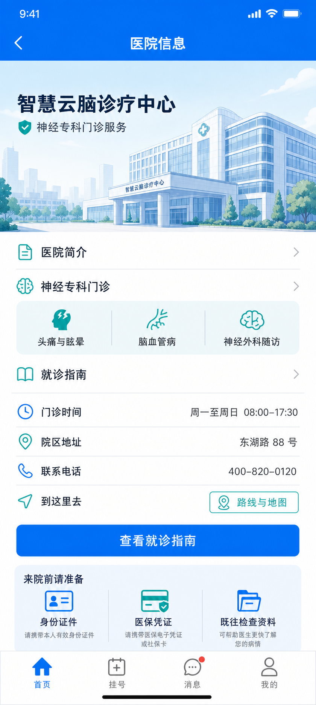

# 患者端医院信息页实施计划

更新时间：2026-07-13  
状态：设计已确认，待实施

## 1. Goal

在患者端首页新增“医院信息”概念展示页，路由定为 `/patient/hospital`。页面帮助首次到院或准备复诊的患者快速了解神经专科服务、来院准备事项和到院方式，并提供进入就诊指南的明确入口。

本页是概念展示，不接入或伪装成真实医院 HIS 数据；所有地址、电话、门诊时段和服务范围均使用清晰标识的示意内容，后续接入真实信息前必须替换为运营确认的数据源。

## 2. Current behavior

- 首页 `PatientHomeView.vue` 已有“医院信息”功能格，文案为“科室介绍、就诊指南”，当前点击无动作。
- `frontend/src/router/index.ts` 尚未注册 `/patient/hospital`，`PatientLayout.vue` 的沉浸式路由白名单也未包含该页面。
- 患者端已形成蓝青色、移动优先、单列阅读的视觉语言；页面宽度、桌面端外框和底部导航由既有 layout / component 统一维护。
- 现有前端计划仅覆盖患者主挂号链路与通知中心，尚未定义医院信息页的内容边界和验收标准。

## 3. Approved concept

### 设计方向

- 延续现有首页的蓝色主色与青绿色辅助色，浅冷色背景、白色信息面，避免营销落地页和大面积装饰性卡片。
- 顶部使用简洁返回栏与医院建筑示意图，建立“来院前查信息”的明确语境；建筑图仅作概念视觉，不代表真实院区。
- 信息以列表行、单个专科服务模块和底部准备清单组织，保证患者可以快速定位时间、地址、电话与路线。
- 重点操作是“查看就诊指南”；路线入口使用地图/导航语义，不在前端伪造地图定位或导航成功状态。

### 页面信息架构

1. 顶部导航：返回首页、标题“医院信息”。
2. 医院概览：名称、神经专科门诊服务说明、概念建筑视觉。
3. 服务入口：医院简介、神经专科门诊、就诊指南。
4. 专科服务：头痛与眩晕、脑血管病、神经外科随访。
5. 来院信息：门诊时间、院区地址、联系电话、路线与地图入口。
6. 来院准备：身份证件、医保凭证、既往检查资料。
7. 保持现有患者端底部导航，当前页不新增第五个导航项。

## 4. Proposed solution

### 4.1 路由与入口

1. 新增 `PatientHospitalInfoView.vue`，注册为公开路由 `/patient/hospital`，名称建议为 `patient-hospital`。
2. 将首页“医院信息”功能格跳转至该路由。
3. 将路由加入 `PatientLayout.vue` 的沉浸式页面列表，复用患者端移动页面壳与底部导航。
4. 返回操作固定回 `/patient/home`，避免在没有历史记录的新窗口中回退到空白页。

### 4.2 内容与交互

- 使用本地静态 `hospitalInfo` 配置对象承载概念文案，并在代码注释或页面说明中明确其为示意数据；不创建接口、store 或 mock API。
- “医院简介”“神经专科门诊”“就诊指南”采用页内锚点/展开说明，或在第一版仅提供可见的详情区块；不制造尚未实现的独立业务页面。
- “路线与地图”第一版仅为不可误导的概念入口，点击显示“导航服务待接入”的轻提示，不能伪造定位、地图或第三方跳转成功。
- “查看就诊指南”滚动并聚焦至指南内容；若后续拆分真实指南页，再替换为路由跳转。

### 4.3 视觉与可访问性

- 使用 `theme.css` 既有 `--patient-*` tokens，不新增与现有语义重复的品牌颜色。
- 正文、描述和按钮文字满足基础 WCAG AA 对比度；状态与重要信息不单靠颜色表达。
- 触控目标不小于既有患者端控件高度，窄屏下保证无横向滚动。
- 仅使用 150–250ms 的状态反馈；遵循 `prefers-reduced-motion`，不使用装饰性进场动效。

## 5. Risks

- 概念地址、电话和服务时间若未标注或未来未替换，容易被误认为真实院方信息。
- 把路线按钮实现为看似可用的地图能力，会产生错误预期；第一版必须保持能力边界。
- 大型建筑图片若直接作为页面内容会造成加载负担和文字可读性下降，应使用轻量 CSS/SVG 插画或经过压缩的本地资源。
- 新页面若重复声明外层宽度、阴影或底部安全区，会破坏患者端 layout 的一致性。

## 6. Validation strategy

- 路由：从 `/patient/home` 的“医院信息”进入 `/patient/hospital`；返回后落在首页。
- 视觉：在 375px、390px、430px 宽度下无横向溢出；桌面预览继续由 `PatientLayout` 统一包裹。
- 内容：概念数据不冒充真实接口数据，未接入能力有明确提示。
- 交互：指南定位可用；路线入口不产生虚假的导航成功反馈；底部导航和首页保持一致。
- 构建：运行 `npm run build`；必要时进行目标路由浏览器回归并检查键盘焦点与缩放阅读。

## 7. Implementation boundary

本计划只覆盖患者端医院信息概念展示页。真实院区资料、地图 SDK、电话拨号、营业时间配置后台、报告查询和在线客服均不在本切片范围内。
