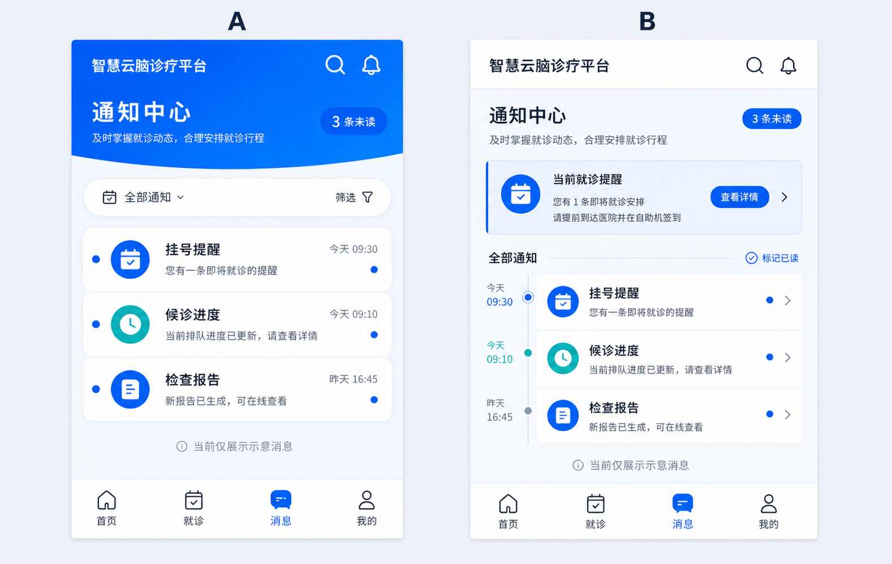

# 患者端通知中心计划

更新时间：2026-07-13

## Goal

补齐患者端底部导航中的“消息”入口，提供一个与现有患者首页一致的高保真移动端通知中心。该页面仅用于演示通知呈现，不实现即时聊天、消息推送、已读回写或后端接口调用。

## Visual reference

已确认采用图中 **A 方案**：以蓝色 Hero、未读标签和纵向通知列表建立首屏层级；B 方案的时间线布局不进入本次实现范围。

## Current behavior

- `PatientBottomNav.vue` 已展示“消息”Tab，但其 `path` 为空，因此按钮被禁用。
- 患者端路由中没有 `/patient/messages`，也没有对应页面组件。
- 现有患者端以 `--patient-*` tokens 为基础，使用蓝色 Hero、浅蓝页面背景、白色圆角内容面板和固定底部导航；主要页面以 430px 移动端容器为设计基准。
- 当前真实业务主链为登录、挂号、支付与候诊。通知中心不应伪装成真实医患沟通或真实医疗业务数据。

## Proposed solution

### 1. 路由与导航

- 新增受现有患者登录守卫保护的 `/patient/messages` 路由，命名为 `patient-messages`。
- 将 `PatientBottomNav.vue` 的“消息”Tab 指向 `/patient/messages`。
- 扩展底部导航的 active-tab 映射，使该路由稳定高亮“消息”。
- 将该路由加入 `PatientLayout.vue` 的 immersive route 列表，避免出现与现有患者页面不一致的通用页头与内边距。

### 2. 页面结构（采用 A 方案）

页面组件命名为 `PatientMessageCenterView.vue`，采用单页静态通知列表：

1. 蓝色 Hero：标题“通知中心”、说明“及时掌握就诊动态，合理安排就诊行程”、未读数量标签。
2. 筛选工具条：仅作为静态视觉元素展示“全部通知”和筛选图标，不提供筛选逻辑。
3. 通知列表：3 条演示通知，分别为“挂号提醒”“候诊进度”“检查报告”；每条包含类型图标、时间、摘要、未读状态点与右箭头。
4. 静态演示边界：本期不提供即时聊天、消息详情、推送或已读交互；该边界由计划和页面能力范围维护，不额外占用页面底部空间。
5. 复用 `PatientBottomNav`，消息 Tab 作为唯一 active 状态。

### 3. 视觉与交互约束

- 延续患者首页的蓝色 Hero、浅蓝渐变背景、深蓝正文、蓝/青两类通知图标和 18px 左右圆角。
- 视觉优先级为：页面标题与未读状态 > 通知标题 > 时间与摘要 > 演示边界说明。
- 仅保留可访问的按钮焦点样式；静态通知项不承诺详情页，不提供虚假的点击行为。
- 保证触屏目标、文字对比度、窄屏布局与 `prefers-reduced-motion` 下的无动画可用性。

## Out of scope

- WebSocket、轮询、服务端通知表、推送权限和未读数持久化。
- 医患即时聊天、会话列表、消息详情与附件。
- 报告实际查询、候诊真实状态跳转或任何医疗结论展示。
- 对现有后端接口、Pinia store 或真实挂号/候诊数据流的改动。

## Risks

- 演示文案过于具体会被误认为真实业务数据；不显示姓名、门诊号、诊断或其他敏感字段，也不提供详情、推送或已读交互。
- 新增路由若未纳入 immersive 列表，会产生重复页头或额外留白，破坏移动端页面连贯性。
- 底部导航的 active-tab 映射遗漏会导致进入通知中心时仍高亮“首页”。
- 页面内容高度接近固定导航时可能被遮挡；底部安全间距必须至少覆盖 `--patient-nav-height`。

## Validation strategy

1. 路由访问：已登录时可从“消息”Tab 进入 `/patient/messages`；未登录时由既有守卫跳转至登录页。
2. 导航回归：消息页高亮“消息”，首页、挂号记录、个人中心的高亮行为不回退。
3. 视觉回归：在 390px、430px 与桌面居中容器下检查无横向溢出、内容不被底部导航遮挡、文本不截断。
4. 可访问性：键盘 Tab 可聚焦导航；正文、摘要与状态点不单独依赖颜色传达信息。
5. 工程验证：执行 `cd frontend; npm run build`。

## Implementation order

1. 新增页面组件和静态演示数据。
2. 接入路由、患者沉浸式布局和底部导航。
3. 在 `docs/frontend-plan.md` 增加路由与“静态演示、未接接口”的当前状态说明。
4. 执行构建与响应式回归；确认无误后再创建单一、聚焦的 Git commit。
