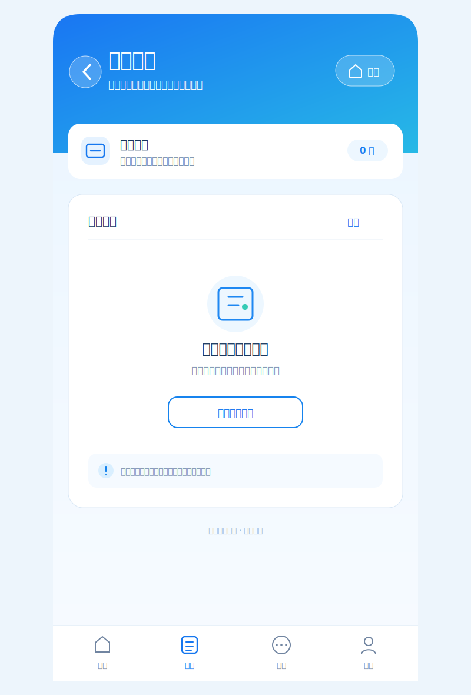

# 患者端缴费中心实施计划

更新时间：2026-07-13

## Goal

将患者首页六宫格中的“历史挂号”替换为“缴费中心”，保留“按科室挂号”作为主挂号入口。患者可在一个页面中查看并合并支付本人挂号下待缴的检查、检验和处置项目；信息架构与数据契约同时为后续药品缴费预留位置。

## Current behavior

- 首页的“按科室挂号”入口跳转 `/patient/departments`；替换后该路由与既有挂号流程仍保留，只是不再占用首页宫格。
- 患者端现有 `/patient/payment` 仅支付 `regist_money`，即线上挂号费，不能读取或支付医生开立的项目。
- 医生端已能创建检查、检验和处置单，并通过 `GET /api/v1/medical/requests/register/{register_uuid}` 读取队列。
- Billing 服务已有 `POST /api/v1/bill/pay` 合并缴费能力，已校验项目归属、状态和金额，并已支持 `检查`、`检验`、`处置`、`药品` 四种类型；成功后以 outbox/MQ 推进 Medical 或 Pharmacy 中的项目状态。
- 当前患者端没有待缴项目聚合接口，也没有项目缴费页面；前端不能直接信任或自行计算项目价格。

## Product and page design

### 缴费中心改版示意（2026-07-13）

当前实现已具备待缴项目查询与支付能力，但空态的层级过深、留白过大，且“查看挂号记录”与缴费任务无关。下一轮仅围绕患者端既有的小程序视觉语言调整，不新增独立风格或红色警示式提示。



示意图对应的页面规则如下：

- 继续复用患者端的蓝色渐变页头、圆角白色卡片、浅蓝内容底色和底部导航，不使用新的页面框架。
- 页头下方只保留一张紧凑的“待缴项目”状态卡，显示本次待缴数量；避免把标题、说明和空态拆成多层大卡片。
- 无待缴项目时，主卡片使用居中的票据图标、明确标题和简短说明；空态按钮改为“查看缴费记录”，不再跳转“挂号记录”。
- “缴费记录”后续通过患者侧 BFF 聚合本人挂号下的已支付账单，再提供受登录保护的记录页；在接口和路由落地前，不让按钮指向无关页面。
- 有待缴项目时沿用同一内容卡展示按挂号分组的清单和底部结算栏，避免空态与有数据状态发生视觉断层。

本示意图是下一步前端改版目标，当前尚未修改 `PatientPaymentCenterView.vue` 的实际布局或按钮行为。

首页只替换一个格子，保持现有 2 × 3 宫格的密度、图标语言和蓝绿配色：

```text
就诊码        缴费中心        候诊状态
缴费中心        报告查询        医院信息
```

“缴费中心”使用现有蓝色功能图标语义，副标题为“检查检验、处置缴费”，并跳转至受登录保护的 `/patient/payments`。

缴费中心页面采用“按挂号分组、按项目类型归类”的单页任务流，不使用弹窗作为主流程：

```text
顶部：缴费中心 / 查看本人待缴项目
挂号选择：当前就诊优先；存在多次就诊时可切换挂号
待缴清单：
  检查（可勾选）
  检验（可勾选）
  处置（可勾选）
  药品（预留分组；一期没有数据时不显示）
底部固定结算栏：已选 N 项、合计金额、微信/支付宝、确认支付
支付完成：账单号、金额和项目状态同步提示；返回清单后刷新
```

页面应明确区分 loading、无待缴项目、部分项目已被其他操作支付、支付提交中和支付成功五种状态。无待缴项目时给出“当前没有待支付的医疗项目”的真实空状态，不展示静态示例账单。移动端结算栏固定在底部导航上方，避免遮挡项目选择。

## Proposed solution

### 1. 患者侧 API 聚合与归属校验

新增 Patient 服务作为患者端唯一 BFF（Backend for Frontend）入口，而不是让浏览器直接组合 Medical、Pharmacy 和 Billing 服务。

- `GET /api/v1/patient/{patient_uuid}/payment-items`
  - Patient 服务先查询该患者本人有效挂号，按最新就诊优先返回每个挂号的待缴项目。
  - 调用 Medical 的挂号项目队列，筛选状态为“未缴费”的检查、检验、处置项目。
  - 返回由服务端给出的项目名称、类型、价格、状态和 `register_uuid`；价格不由前端计算。
  - 第一阶段返回空的 `medications` 分组；后续接入 Pharmacy 时扩展同一响应，不改变页面或结算请求的主体结构。

- `POST /api/v1/patient/payment-items/pay`
  - 请求包含 `patient_uuid`、`register_uuid`、选中的项目 ID、支付方式和幂等键。
  - Patient 服务先验证挂号归属当前患者，再代理到 Billing 的 `POST /api/v1/bill/pay`。
  - Billing 继续作为金额计算、状态校验、落单、事务与 outbox 的唯一权威服务；Patient 服务不复制收费逻辑。

建议标准化给前端的项目对象：

```ts
type PayableItemType = 'check' | 'inspection' | 'disposal' | 'medication'

interface PayableItem {
  uuid: string
  type: PayableItemType
  title: string
  amount: string
  state: 'unpaid'
  register_uuid: string
  quantity?: number
}
```

Patient BFF 在内部将类型映射为 Billing 既有的中文枚举（`检查`、`检验`、`处置`、`药品`），避免前端依赖下游服务的实现细节。

### 2. 前端路由、API 与首页入口

- 在 `frontend/src/router/index.ts` 新增 `/patient/payments`，设置 `requiresAuth: true`。
- 在 `frontend/src/api/patient.ts` 增加待缴项目读取和提交缴费的类型、API 调用；保留现有 `/patient/payment` 挂号费页面，不与项目缴费混用。
- 新建 `frontend/src/views/patient/PatientPaymentCenterView.vue`，复用 `PatientFlowHeader`、`PatientBottomNav`、现有患者端 token 与 Element Plus 表单控件。
- 将 `PatientHomeView.vue` 的 `departments` 宫格改为 `payments`，文字为“缴费中心 / 检查检验、处置缴费”；挂号流程的已有路由保持不变。

### 3. 延展到药品缴费

药品不是第二套页面，而是同一缴费中心的第四个分组。后续仅增加：

1. Patient BFF 从 Pharmacy 聚合可支付处方项目；
2. 页面解除 `medications` 空分组的隐藏条件；
3. 复用同一勾选、总价和合并支付请求。

Billing 当前已对药品支付要求“病历经医生确认”，该规则继续放在 Billing 服务端执行，前端只展示后端返回的可支付项目。

## Execution order

1. **已完成（2026-07-13）**：新增 `GET /api/v1/patient/{patient_uuid}/payment-items` 与 `POST /api/v1/patient/payment-items/pay`。Patient BFF 聚合本人有效挂号下未缴费的检查、检验、处置项目，校验患者与挂号归属后代理现有 Billing 合并支付接口；后端回归覆盖下游路由、待缴筛选、类型映射和越权挂号拦截。
2. **已完成（2026-07-13）**：新增 `/patient/payments` 受保护路由、患者端缴费 API 类型与 `PatientPaymentCenterView.vue`；首页宫格已将“历史挂号”替换为“缴费中心”，并保留“按科室挂号”。页面支持加载、空态、失败、同挂号限定选择、微信/支付宝模拟支付与支付后的三次状态刷新。
3. **已完成（2026-07-13）**：支付成功后前端会进行三次短间隔刷新，以等待 MQ 将项目从“未缴费”回写为已缴费；超过该观察窗口时保留当前真实返回状态，不伪造同步完成。
4. **待实施（已完成设计）**：按上述示意图重构 `/patient/payments` 的页头下状态区、空态和内容卡；空态操作改为“查看缴费记录”。同时新增患者侧已缴费账单聚合接口与受保护的缴费记录路由，确保该入口指向真实数据。
5. 完成检查、检验、处置的端到端回归：医生开单 → 患者选项缴费 → Billing 落单 → Medical 状态变为“已缴费” → 医生端可选择 CT 序列。
6. 在既有数据契约不变的前提下接入 Pharmacy 的 `medications` 分组。

## Risks

- 当前各端的登录身份主要存在于前端 session；BFF 必须在现有边界内至少做患者与挂号的服务端归属校验。后续接入统一令牌后，应由令牌身份替代前端传入的 `patient_uuid`。
- Billing 的项目状态由 MQ 异步回写，支付成功后不能假设医生端瞬间变为“已缴费”；页面需刷新并说明同步状态。
- 一个患者可能存在多个有效挂号，禁止把不同 `register_uuid` 的项目混在同一笔结算中。
- 药品按处方整体结算的既有 Billing 规则必须保留，不能将前端单个药品勾选误当作独立处方支付。

## Validation strategy

- 后端：患者无法查询或支付他人挂号；非“未缴费”项目被拒绝；混合项目金额由 Billing 计算；重复提交同一幂等键返回同一结果。
- 前端：未登录跳转登录页；多挂号切换正确；空态、加载态、部分已支付和提交失败可读；375px 与 430px 宽度下结算栏不遮挡内容。
- 集成：使用一张真实已支付挂号创建 CT 检查单，完成项目缴费后确认医生端的 CT 序列控件解除缴费状态限制。
