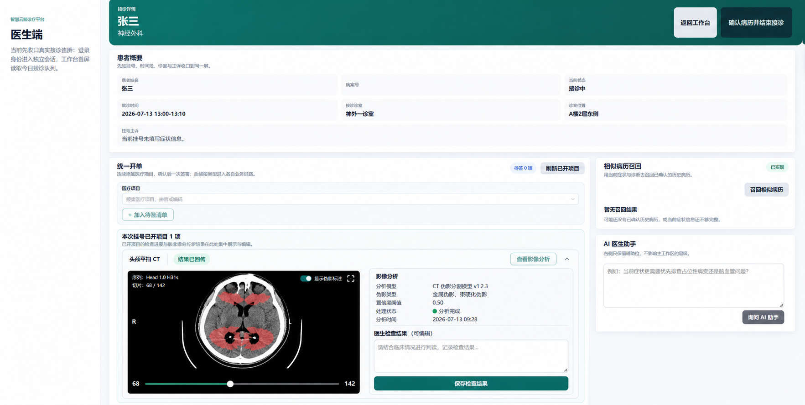

# 检查检验报告查验与伪影掩码 UNet2D 接入计划

更新时间：2026-07-13
状态：模型契约已核验；尚未实施。

## Goal

建立“医生审核并发布，患者只读查验”的检查检验报告闭环；对适用的影像检查，医生端可以发起伪影掩码 UNet2D 推理、查看叠加结果和模型元数据，并由医生确认后写入正式报告。

## Current behavior

- 医生接诊页（`/doctor/encounter/:registerId`）已能统一开立检查、检验、处置项目，并按本次挂号轮询项目状态。
- Medical 服务已存在检查与检验结果回写接口：`PUT /api/v1/medical/check/{uuid}/result`、`PUT /api/v1/medical/inspection/{uuid}/result`，并可按挂号读取项目队列：`GET /api/v1/medical/requests/register/{registerUuid}`。
- `CheckRequest` 已有影像路径、AI 概率和文字结果字段；`InspectionRequest` 已有结构化 `test_results` 字段。
- 当前 `ai_image_inference.py` 是基于文件名和随机数的 Mock，不可用于真实推理或临床结论。
- 患者端暂无真实报告列表、详情或下载入口；现有“检查报告”仅出现在静态通知示意中。

## 医生接诊页内嵌影像分析设计



功能直接落在现有接诊页 `/doctor/encounter/:registerId` 的“本次挂号已开项目”区域：检查项目完成结果回传后，医生从该项目条目展开查看影像分析并填写检查结果，不新增独立报告审核页或额外主导航。

### 设计目标

- 保持截图中“患者摘要 → 统一开单 → 本次挂号已开项目”的工作顺序，医生不离开当前接诊上下文。
- 影像分析只服务对应的检查条目；相似病历与 AI 医生助手继续留在右侧支持栏，功能职责不互相抢占。
- 取消红色风险框、勾选确认和额外说明文案；模型信息以紧凑的“影像分析”字段组呈现。

### 页面结构

```text
现有患者摘要
现有统一开单

本次挂号已开项目
└─ 检查 · 头颅平扫 CT · 结果已回传        [查看影像分析] [展开/收起]
   └─ 展开区（仅当前检查项）
      ├─ 左：CT 影像、伪影标注开关、切片滑杆和序列信息
      └─ 右：影像分析（模型 / 阈值 / 处理状态 / 时间）
              医生检查结果（可编辑）
              [保存检查结果]

右侧原有栏：相似病历召回、AI 医生助手
```

### 关键交互与状态

| 场景 | 条目表现 | 医生可执行操作 |
| --- | --- | --- |
| 待缴费 / 已缴费 | 保持现有状态回看，不显示影像入口 | 无 |
| 结果处理中 | 检查条目显示“分析中”，展开区展示处理进度 | 刷新状态 |
| 结果已回传 | 显示“查看影像分析”，展开后显示影像与模型字段 | 开关伪影标注、切换切片、填写并保存检查结果 |
| 分析未完成 | 展开区显示当前处理状态，不展示虚构 mask | 刷新状态；继续人工填写检查结果 |
| 已保存结果 | 保留影像入口和医生填写的结果文本 | 修改并再次保存，保留版本记录 |

### 视觉与可访问性约束

- 沿用当前接诊页深青绿按钮、浅蓝灰面板、14–18px 圆角和紧凑的项目条目密度；不引入第二套后台外观。
- 伪影 mask 使用半透明珊瑚红叠加，同时提供“显示伪影标注”文字开关，不能只依赖颜色。
- “影像分析”字段组仅显示模型名称、版本、阈值、处理状态和完成时间；不设置醒目的风险提示框。
- “保存检查结果”是展开区唯一主要操作；“查看影像分析”、刷新、展开/收起和标注开关均是次级操作。
- 宽度低于 1180px 时，展开区由左右两列改为影像在上、分析与结果输入在下；低于 720px 时，切片滑杆与操作按钮全宽排列。

## Proposed solution

### 1. 优先顺序：先医生端闭环，再患者端查验

先完成医生端的“结果进入、模型辅助、人工审核、发布”闭环，再开放患者端只读查验。

原因：

1. 报告的真实性、可见性和责任边界必须先由医生端确定；患者端不应展示未审核、推理失败或仅供医生参考的结果。
2. UNet2D 的输出是影像质量 / 伪影辅助信息，不应自动等同于诊断报告；需要医生审核动作和审核留痕。
3. 后端报告聚合、权限和发布状态确定后，患者端只是稳定的只读消费者，避免重复设计和返工。

建议交付顺序：

1. 医生端检查报告录入与审核发布（MVP）。
2. 医生端检验报告结构化录入与审核发布（MVP）。
3. 影像检查接入 UNet2D 推理与掩码可视化（仅适配已确认的影像类型）。
4. 患者端报告列表、详情和发布后查验。

### 2. 数据与状态边界

新增独立的报告发布语义，不以“已执行”替代“患者可见”：

`已缴费 -> 已执行/待结果 -> 待医生审核 -> 已发布 -> （可选）已更正`。

- 保留检查、检验各自原有状态机；报告状态单独表达结果是否已发布。
- 每一份报告至少保存：项目 UUID、挂号 UUID、报告类型、结构化结果或正文、附件 / 影像引用、审核医生、审核时间、发布状态、版本号。
- AI 结果与正式报告分离保存：模型名称和版本、权重标识、阈值、输入摘要、输出掩码引用、指标、推理时间、错误信息、生成时间。AI 结果默认仅医生可见。
- 不保存原始影像二进制到数据库；数据库只保存由受控存储服务生成的对象引用及必要元数据。

### 3. 真实模型的服务边界

不要把 PyTorch / MONAI 模型加载进 FastAPI 请求处理函数，也不要在前端调用模型。

推荐先将模型封装为内部推理服务（可独立进程 / 容器）：

`Medical API -> inference job / internal HTTP client -> Artifact-UNet2D service -> object storage + structured result -> Medical API`。

第一版采用异步任务：提交后立即返回任务 ID；医生端轮询或接收状态更新。这样可隔离 GPU / CPU 资源、避免请求超时，并保留失败重试与审计能力。

模型服务的最小契约应明确：

- 输入：受控影像引用或上传后的临时对象引用，影像格式、序列 / 模态、像素值范围、方向与 spacing 规则。
- 输出：掩码对象引用、可预览叠加图引用、是否检测到伪影、像素级 / 切片级评分、质量控制指标、模型版本、错误码。
- 约束：最大文件大小、允许格式、超时、幂等键、重试语义、鉴权方式与不记录患者敏感信息的日志策略。

### 4. 页面与接口切片

医生端：

- 在接诊页保留现有“已开项目状态回看”；对“待审核 / 已发布”的项目提供明确入口。
- 在现有“本次挂号已开项目”的检查条目展开区展示原始结果、影像预览、AI 掩码叠加、模型信息和医生检查结果编辑。
- 模型不可用时不阻断人工结果录入与保存；页面只呈现实际任务状态，不以 Mock 结果填充。

后端：

- 用按挂号聚合的报告列表接口服务两端，按角色过滤字段与可见状态。
- 新增上传 / 受控对象引用、推理任务创建与查询、医生审核发布接口；检查和检验结果回写接口改为生成“待审核”报告草稿，而非直接对患者可见。
- 加入所有权校验：医生只能审核自己有接诊权限的挂号；患者只能读取本人已发布报告。

患者端：

- 在首页或个人中心新增“报告查验”入口，优先采用独立路由 `/patient/reports`。
- 列表仅展示已发布报告，按就诊 / 日期 / 类型筛选；详情展示医生确认的结论、结构化指标和安全的附件预览。
- 不展示 AI 原始掩码、内部评分、模型版本、内部路径或未审核草稿；更正报告应明确版本和发布时间。

## Model information required before implementation

需要从训练项目确认：

1. 权重与代码：仓库或目录、checkpoint 文件名与格式（`.pt` / `.pth` / TorchScript / ONNX）、推理入口。
2. 模型定义：UNet2D 实现依赖、输入通道数、输出通道 / 类别、激活函数与阈值。
3. 预处理：接受 DICOM、NIfTI 还是 PNG/JPEG；窗宽窗位、归一化、resize / crop、切片选择、方向与 spacing 规则。
4. 后处理：mask 的含义、连通域 / 阈值规则、是否输出置信度或质量评分、叠加图生成方式。
5. 运行条件：Python、PyTorch、CUDA / CPU、显存和单次推理时延、依赖文件、许可证。
6. 验证证据：一组可脱敏样例、预期 mask / 指标、模型版本与适用范围；该模型是否仅用于伪影检测 / 分割，不能推导疾病诊断。

## Confirmed model integration baseline

已于 2026-07-13 在 `D:\work\NeuEduPython` 核验以下事实：

- 可复用入口是 `src/Detection/CTArtifactInfer.py` 的 `CTArtifactInfer`；默认应使用 attention 变体。
- 权重为 `src/BrainCT/results/attention_unet2d/weights/best.pth`，SHA-256 为 `8F61F71964621BB104CBF8CD72D4872FD257DFF8123CC9B9B0E17575E0D3FBE1`。
- 模型是单通道、单输出二值分割：`0` 为非伪影 / 背景，`1` 为伪影区域；输出经过 sigmoid 后以 `> 0.5` 阈值二值化。
- 训练与推理都对每张 2D slice 做 Z-score；训练数据读取 DICOM 的原始 `pixel_array`，没有 HU 转换、窗宽窗位、方向统一、spacing 重采样或 resize。
- 推理类直接支持 NIfTI (`.nii` / `.nii.gz`) 或 `SimpleITK.Image`；不提供 DICOM 文件 / 序列路径入口。若产品上传 DICOM，必须先完成安全的序列读取与转换，再传入 `predict_from_sitk`。
- 网络有三次 `MaxPool2d(2)` 与 skip connection 拼接；API 在推理前必须拒绝 H、W 不是 8 的倍数的输入，或由模型服务以明确、可验证的规则 padding 后再还原。
- 最佳记录仅为 460 张切片、随机切片级划分的内部验证：Dice 0.5343、Precision 0.6175、Recall 0.5664；没有病例级划分、外部验证或临床验证。因此只能作为研究 / 演示型伪影质量控制辅助，不能作为诊断、分诊或自动报告结论。
- 专用 Conda 环境 `py3106` 位于 `D:\develop\Anaconda\envs\py3106`，已安装 `torch`、`SimpleITK`、`pydicom`；不需要额外克隆环境。通用独立 Python 环境不作为推理入口。

## Recommended first implementation slice

目标是先跑通受控的影像质量辅助闭环，范围限定为“单个 NIfTI 脑 CT 体数据 -> 掩码 NIfTI + 一张预览叠加图 -> 医生端只读查看”。不接入患者端、不自动改变诊断或正式报告。

1. 在训练仓库或独立部署目录创建最小 FastAPI 推理服务，启动时只加载一次 `CTArtifactInfer(model_variant="attention")`；将模型权重路径和 SHA-256 配成环境变量，并在启动时校验。
2. 新增 `POST /v1/artifact-segmentation`：接收 `multipart/form-data` 的 `.nii` / `.nii.gz`，校验单通道三维体数据、H/W 为 8 的倍数、文件体积和解压后体素上限。
3. 以单并发队列执行推理；保存 mask NIfTI 和中间切片叠加预览到受控对象存储，响应任务 ID、模型元数据和文件引用。不要返回服务器本地绝对路径。
4. 在 SmartBrainClinic 的 Medical 服务增加内部客户端和异步任务记录；只允许与当前检查单绑定的、已上传受控影像触发推理。
5. 医生端在当前接诊页的检查条目展开区展示预览、mask 引用、推理状态和权重版本；只有医生填写并保存的文本才能成为正式检查结果。
6. 用一组脱敏 NIfTI 与人工 mask 做固定回归；在此之前，不将服务暴露给患者端或写入演示为“AI 已诊断”。

## 第一阶段验证记录（2026-07-13）

本地模型运行环境与真实 DICOM smoke test 已完成：

- 输入：`CQ500CT0 CQ500CT0` 中一个 239 层的 DICOM 序列，尺寸为 `512 × 512 × 239`，spacing 为 `0.443359 × 0.443359 × 0.625 mm`；原始数据保持只读。
- 环境：`D:\develop\Anaconda\envs\py3106\python.exe`，使用本机 RTX 4060 Laptop GPU（8 GB）。
- 模型：attention UNet2D，权重 SHA-256 与预期值一致。
- 输出：`D:\work\NeuEduPython\outputs\artifact_inference_smoke\CQ500CT0\artifact_mask.nii.gz`、`artifact_overlay.png`、`run_metadata.json`。
- 结果：完整体数据推理耗时 `14.207 s`，输出 mask 保持 `512 × 512 × 239` 尺寸与原始 spacing；当前检测到 `21,362` 个 mask 像素。
- 验证边界：该测试证明本机环境、权重加载、DICOM 序列读取、推理、NIfTI 写出及预览生成可工作；没有人工 ground-truth mask，因此不能在该样本上计算 Dice 或评价模型质量。

新增可重复运行脚本：`D:\work\NeuEduPython\src\Detection\run_ct_artifact_smoke_test.py`。请从 `D:\work\NeuEduPython\src` 使用专用解释器按模块方式运行：

```powershell
& 'D:\develop\Anaconda\envs\py3106\python.exe' -m Detection.run_ct_artifact_smoke_test `
  --dicom-dir 'D:\work\NeuEduPython\data\CQ500_orig\CQ500_orig\CQ500CT0 CQ500CT0\Unknown Study\CT 4cc sec 150cc D3D on' `
  --output-dir 'D:\work\NeuEduPython\outputs\artifact_inference_smoke\CQ500CT0' `
  --model-variant attention
```

不使用 `conda run` 作为运行入口：当前 Windows 终端会在回显模型旧日志时触发 GBK 编码异常，尽管推理已完成；直接调用 `py3106` 的 Python 可避免该启动器问题。

## 第二阶段：运行集迁移与本地数据预留（2026-07-13）

已将可独立运行的最小模型代码迁入本项目：

- `backend/model_services/ct_artifact/model/attention_unet2d.py`：Attention UNet2D 网络定义。
- `backend/model_services/ct_artifact/inference.py`：权重完整性校验、NIfTI / SimpleITK 推理和单序列 DICOM 读取。
- `backend/runtime/models/ct_artifact/attention_unet2d_best.pth`：本地复制的权重；该文件被 Git 忽略。
- `backend/runtime/data/ct_artifact/input/`、`ground_truth/`、`output/`：为后续手动复制的数据预留的本机目录；均被 Git 忽略。

不迁移 CQ500 原始数据、训练脚本、训练图表、`CTArtGui.py` 或旧 smoke-test 输出。模型运行时继续使用本机 Conda 环境 `py3106`，不混入 Medical 微服务的通用依赖环境。

迁移验证已完成：使用本机 `py3106` 从本项目的 `backend/runtime/models/ct_artifact/attention_unet2d_best.pth` 加载权重，并对既有 CQ500CT0 的一套 239 层 DICOM 序列完成 CUDA 推理。输出 mask 为 `512 × 512 × 239`，spacing 为 `(0.443359, 0.443359, 0.625)`，与输入一致；本次输出仅保留在被 Git 忽略的 `backend/runtime/data/ct_artifact/output/migration_smoke/`。

后续手动复制数据时，请按下列方式放置：

```text
backend/runtime/data/ct_artifact/
├── input/
│   ├── CQ500CT0/
│   │   └── CT 4cc sec 150cc D3D on/   # 一个目录只放一套 DICOM series
│   └── patient-001.nii.gz             # NIfTI 也可直接放在 input 下
├── ground_truth/                       # 可选：与输入对应的人工 mask
└── output/                             # 系统生成，勿手动覆盖
```

若直接复制完整 `CQ500_orig`，请放入 `input/CQ500_orig/`；后续调用时需要下钻到其中具体的单一序列目录，不能把包含多个病例或多个 series 的根目录直接传给推理器。

## Planned implementation order

1. **推理服务可验证化**：在独立 Python 进程中安装并锁定 `torch`、`SimpleITK`、`pydicom` 依赖；使用脱敏 NIfTI 完成权重加载、mask 文件和叠加 PNG 的真实回归。
2. **Medical 后端契约**：增加影像对象引用、推理任务、任务状态、模型元数据和报告发布版本；保持既有检查 / 检验开单接口兼容。
3. **医生端项目内嵌区**：扩展现有接诊页的“本次挂号已开项目”、API 层和检查结果保存能力；先完成加载、分析中、结果回传、分析未完成和已保存五种状态，再接入真实数据。
4. **权限与审计**：校验医生接诊权限、对象访问权限、发布操作和更正版本；日志不记录原始患者影像路径或 DICOM 敏感字段。
5. **患者端查验**：待医生发布闭环和权限测试通过后，再增加只读报告列表与详情页；不显示 mask、阈值、权重或内部任务状态。

## Expected file changes

- `backend/app/microservices/medical/models/medical.py`：报告、推理任务和发布版本数据模型。
- `backend/app/microservices/medical/api/medical.py`：任务提交、查询、审核发布与医生报告读取接口。
- `backend/app/microservices/medical/services/`：内部模型服务客户端、状态转换和对象引用处理。
- `frontend/src/api/medical.ts`：影像分析与检查结果保存相关 types、API 调用。
- `frontend/src/views/doctor/DoctorEncounterView.vue`：在既有“本次挂号已开项目”中增加可展开的影像分析区。
- `docs/assets/doctor-encounter-artifact-analysis-concept-2026-07-13.png`：本次接诊页内嵌影像分析概念图。

## Risks

- 将伪影掩码误用为诊断结论，会产生错误的临床语义和安全风险。
- DICOM 多序列、方向、像素值和切片组织若与训练时不一致，掩码会失真；必须用训练项目的预处理复现验证。
- 患者影像、模型输出与日志均包含敏感医疗数据，需要受控对象存储、短期访问链接、最小权限和审计。
- 当前模型为 Mock；在真实模型接入和样例比对通过前，不得以“AI 已分析”展示或发布结果。

## Validation strategy

1. 单元测试：状态转换、权限、发布可见性、模型响应映射、失败 / 超时 / 重试。
2. 契约测试：用模型项目提供的固定脱敏样本，验证预处理后的输入形状、mask 尺寸、阈值结果和模型版本。
3. API 集成测试：医生提交推理、审核发布；患者只能获取本人已发布版本。
4. 前端回归：医生端加载、空、推理中、失败、审核和更正；患者端列表、详情、无报告和权限拒绝。
5. 人工验收：以一条完整挂号为样本，从开单到结果回填、医生发布、患者查验；模型输出由具备业务资质的人员确认其展示语义。

## Decision points for discussion

1. “报告查验”第一期是否只覆盖检查影像，还是同时包含结构化检验结果？建议同一报告框架、分两批页面交付。
2. 伪影掩码的定位是否为影像质量控制辅助，而非疾病分割 / 诊断？建议明确为前者，除非训练项目有相反证据。
3. 模型是嵌入现有部署主机，还是独立 GPU 推理服务？建议独立服务。
4. 患者端第一期是否需要 PDF 下载？建议先做在线只读，报告版式和电子签名明确后再做下载。
