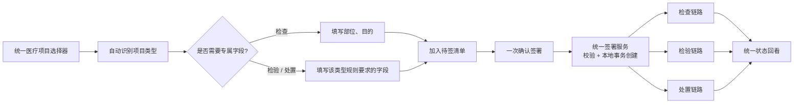
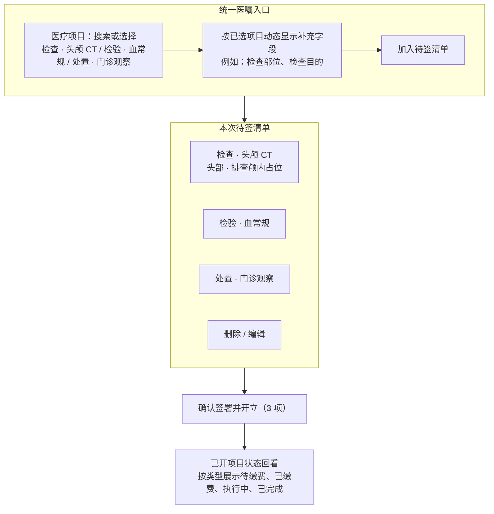

# 医生端统一医嘱入口计划

更新时间：2026-07-11
状态：第一阶段已实现；幂等与下游派发可观测性待后续硬化

## Goal

把“检查、检验、处置”从三套医生操作卡片收敛为一个统一的**医疗项目 / 医嘱**入口：医生连续添加项目，在同一张待签清单中核对后一次签署。合并的是医生的输入和签署体验；项目类型、收费、执行、结果回传、审计和权限仍按各自业务链路处理。

这符合 CPOE 的工作模型：医生以诊疗方案为单位发起诊断与治疗服务请求；USCDI 也将 laboratory、diagnostic imaging、clinical test 与 procedure 作为异构的 order 类型，强调它们共享“服务请求”语义、但保留不同的领域特征。[HealthIT CPOE 说明](https://www.healthit.gov/topic/health-it-and-health-information-exchange-basics/glossary) [USCDI Orders](https://isp.healthit.gov/uscdi-data-class/orders)

## Current behavior

- 接诊页入口为 `/doctor/encounter/:registerId`，实现位于 `frontend/src/views/doctor/DoctorEncounterView.vue`。
- 当前页面将检查、检验、处置拆为三张并列卡片，分别维护表单、校验、加载态和“开立”按钮。
- 后端已有三个单项创建接口：`POST /api/v1/medical/check`、`/inspection`、`/disposal`；已开项目通过 `GET /api/v1/medical/requests/register/{register_uuid}` 回看。
- 三种请求已经使用不同数据表、状态字段和后续处理逻辑；这是应保留的业务边界，而不是 UI 合并后应消失的差异。

## Design decision

| 层面 | 方案 |
| --- | --- |
| 医生操作界面 | 合并：一个“医疗项目”搜索/选择框、一张待签清单、一个“确认签署并开立”按钮。 |
| 类型与必填信息 | 保留差异：所选项目携带类型；检查按规则显示部位、目的等补充字段，其他类型显示其专属字段。 |
| 签署与创建 | 统一：一次签署请求校验并创建本次待签项目；本地写入失败时整体回滚，避免只创建部分记录。 |
| 下游业务 | 分开：检验进入 LIS 对接链路，影像检查进入 RIS/PACS 或影像执行链路，处置进入治疗/执行链路。 |
| 状态、审计与权限 | 分开保留：每个项目维持原类型、状态机、创建时间、操作人和后续处理记录。 |

## Visual continuity constraints

统一开单不是新页面、不是新路由，也不改变医生端的页面骨架；它只替换接诊详情左侧主工作区中的“三张开单卡片”。实现必须沿用当前 `DoctorEncounterView.vue` 与 `DoctorWorkbenchView.vue` 已建立的视觉语言：

- 保留医生端左侧导航、接诊页深青绿 Hero、患者摘要、右侧“相似病历召回 / AI 医生助手”支持栏，以及现有的主区 / 支持区双栏布局。
- 统一开单位于当前“检查检验处置” `SectionCard` 的位置；标题调整为“统一开单”，但继续使用现有的 `SectionCard` 标题、说明、额外操作区和卡片间距。
- 保留中文优先字体栈、深色标题、蓝灰辅助文字、细浅蓝灰边框、`14–18px` 圆角和浅色工作台背景；页面级强调色仍是医生端深青绿 `#0f766e → #115e59`。
- “确认签署并开立”沿用深青绿 primary button；“加入待签清单”、刷新、编辑和删除均为低强调操作。蓝色仅可用于信息/进行中状态，不能把统一开单改造成蓝色独立产品页。
- 类型只在搜索结果和待签行中以小标签出现，用于识别“检查 / 检验 / 处置”；禁止重新引入 Tab、分段控件、三栏面板或三个独立提交按钮。
- 已开项目状态回看继续使用真实接口数据，并保持在统一开单卡片之后；右侧 AI 辅助区域不参与开单主流程，也不因本次改造改变位置或视觉权重。

## Target interaction



### 页面线框图



### 交互规则

- 页面上**不再出现**检查、检验、处置三张卡片、三个按钮或类型切换 Tab；类型是“医疗项目”数据的属性，而非医生必须先做的页面分流。
- 项目选择器使用一个输入框，可按名称、拼音或编码搜索；结果用小型类型标签帮助识别，例如“检查”“检验”“处置”。
- 选择项目后才动态显示其专属字段。检查项目保留“部位、目的”；未要求补充字段的项目可直接加入清单。
- “加入待签清单”只编辑前端草稿，不产生医嘱；清单支持删除和编辑。签署后禁止直接修改已开项目，避免破坏审计链。
- 底部只保留一个主要动作：`确认签署并开立（N 项）`。签署成功后清空草稿并用现有回看接口读取真实已开状态。

## Technical plan

### 1. 统一签署契约，保留类型化请求

新增一个面向医生端的聚合签署接口：

`POST /api/v1/medical/orders/sign`

```json
{
  "register_uuid": "...",
  "items": [
    {
      "type": "check",
      "medical_technology_id": 101,
      "check_position": "头部",
      "check_info": "排查颅内占位性病变"
    },
    { "type": "inspection", "medical_technology_id": 202 },
    { "type": "disposal", "medical_technology_id": 303 }
  ]
}
```

接口职责是“签署一组异构服务请求”，不是制造新的混合业务表：

1. 在签署前校验挂号状态、项目存在性、项目类型匹配和每种项目的专属字段。
2. 在当前医疗服务的本地事务内，分别创建 `CheckRequest`、`InspectionRequest`、`DisposalRequest`，任一创建失败则全部回滚。
3. 返回每个项目的 UUID、类型和初始状态，供前端刷新统一回看区。
4. 事务提交后发布类型化后续任务：检查沿用技师分配/影像执行路径，检验交给 LIS 对接路径，处置交给执行路径。

不要求三个下游系统在同一分布式事务中同步成功：签署后的每个项目应有“待派发 / 派发失败 / 已派发”等可追踪状态，并通过可靠消息或重试补偿处理下游暂时不可用；不能因为外部执行端短暂失败而悄然丢弃已经签署的医嘱。

### 2. 前端改造

- 在 `frontend/src/api/medical.ts` 增加聚合签署 payload/result 与 `signOrders` 方法；保留三个旧单项 API，避免破坏其他调用方。
- 将 `DoctorEncounterView.vue` 的三套 `orderForms`、三个提交状态和三个提交函数，替换为：当前编辑项、`pendingOrders` 草稿清单、一个签署状态。
- 复用当前并行加载的三类 `technologyOptions`，合并成一个带 `type` 的可搜索选项列表；类型标签仅用于结果识别。
- 已开项目仍由现有 `getRegisterRequests` 获取，并按类型/状态分组展示；待签草稿绝不冒充已创建数据。
- 仅在当前 `SectionCard` 内重组 DOM 与 scoped CSS；复用现有 Hero、摘要、右侧支持栏、按钮和卡片视觉语义，不新增页面级布局或路由。

### 3. 异常、审计与幂等

- 前端在“加入清单”时进行轻量必填校验；服务端在签署时做最终权威校验。
- 若签署前有任一项目无效，接口返回逐项错误，前端保留整个草稿并聚焦问题行，医生修正后再签署。
- 第一阶段已在前端签署期间锁定编辑、删除与主按钮，避免同页面重复提交；网络超时后的跨请求幂等仍需通过持久化 `idempotency_key` 实现。
- 每条已创建记录保留原类型、创建人、创建时间、挂号关联和状态迁移日志；聚合签署可额外记录一个 `sign_batch_id` 作为同次签署关联键，但不能替代单项审计。

## Implementation steps

1. **已完成**：在医疗服务补齐聚合签署的 schema、`POST /api/v1/medical/orders/sign` 路由和单次 `flush` 的混合创建服务；三个存量单项接口保持兼容。
2. **已完成**：签署前类型校验、检查专属字段校验、不可用项目校验及写入异常回滚；检查项目仍沿用既有技师分配任务。
3. **已完成**：接诊页改为单一“医疗项目”搜索框、动态字段、待签清单和一次签署按钮；保留既有接诊页布局与已开项目回看。
4. **待后续硬化**：为网络超时补充持久化 `idempotency_key`，并为检验/处置下游派发和派发失败补充可观测状态。
5. **已完成**：更新 `docs/frontend-plan.md`，写明统一入口已落地、下游链路仍按类型分开及当前验证边界。

## Validation strategy

- 已验证后端：混合三类型签署、项目类型不匹配零创建、检查专属字段、写入失败回滚与检查任务派发；定向 `pytest` 为 10 passed。
- 已验证前端：医疗项目搜索、检查动态字段、加入待签清单和单一签署按钮的启用逻辑；`frontend npm run build` 已通过，演示接诊页控制台无错误。
- 待补充集成验证：真实签署后检查、检验、处置各自下游的派发/失败处理，以及网络超时的持久化幂等。
- 待补充桌面集成验证：统一开单卡片在标准医生工作台宽度下的可读性与主按钮可见性。

## Scope boundary

本切片不合并收费、执行、结果录入、退款或跨系统调度实现；它只统一医生的开单与签署入口，并为后续按类型处理保留清晰、可审计的业务边界。
