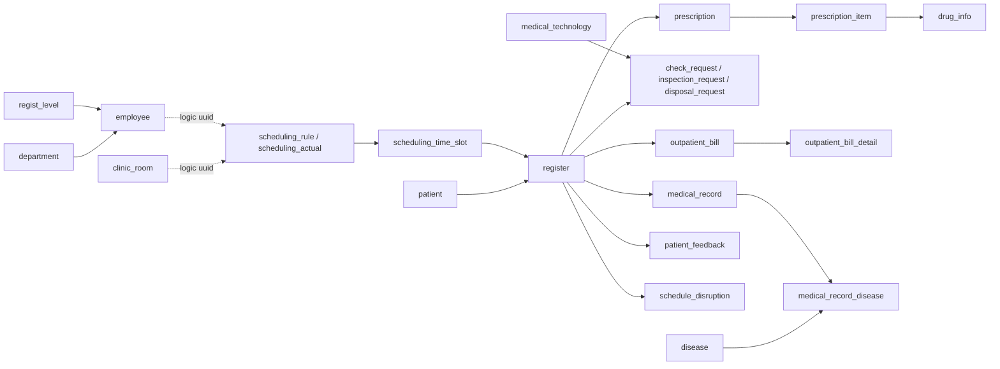

# 数据库表结构说明

本文基于 `his_db` 的 **当前 `public` schema 实例**整理，时间点为 **2026-07-09**。当前库中共有 **31 张表**，主要服务于门诊患者、医生、检查检验、处方发药、收费退费以及系统审计等流程。

## 1. 总体说明

- 当前主数据库为 **PostgreSQL**，项目运行时连接的业务库名为 `his_db`。
- 文中描述的是**当前库里真实存在的表**，不是仅根据代码模型推测。
- 这个项目虽然按微服务拆分代码，但数据库层并没有把所有跨域关系都声明成外键。
- 因此关系分为两类：
  - **硬关系**：数据库里真实声明了 `FOREIGN KEY`。
  - **逻辑关系**：代码中通过 `uuid`、`register_uuid`、`employee_uuid`、`settle_category_uuid` 等字段关联，但数据库未强制约束。

## 2. 核心业务链路

最重要的主链路可以概括为：

## 3. 关系阅读方法

### 3.1 真正声明了外键的关系

- `employee.dept_id -> department.id`
- `employee.regist_level_id -> regist_level.id`
- `register.patient_id -> patient.id`
- `register.scheduling_actual_id -> scheduling_actual.id`
- `register.scheduling_time_slot_id -> scheduling_time_slot.id`
- `scheduling_time_slot.scheduling_actual_id -> scheduling_actual.id`
- `medical_record_disease.medical_record_id -> medical_record.id`
- `medical_record_disease.disease_id -> disease.id`
- `check_request.medical_technology_id -> medical_technology.id`
- `inspection_request.medical_technology_id -> medical_technology.id`
- `disposal_request.medical_technology_id -> medical_technology.id`
- `prescription_item.prescription_id -> prescription.id`
- `prescription_item.drug_id -> drug_info.id`
- `outpatient_bill_detail.bill_id -> outpatient_bill.id`
- `billing_item_charge_lock.bill_id -> outpatient_bill.id`
- `schedule_disruption.patient_id -> patient.id`
- `schedule_disruption.register_id -> register.id`

### 3.2 只有逻辑约束、没有数据库外键的高频关系

- `clinic_room.dept_uuid -> department.uuid`
- `scheduling_rule.employee_uuid -> employee.uuid`
- `scheduling_rule.clinic_room_uuid -> clinic_room.uuid`
- `scheduling_actual.employee_uuid -> employee.uuid`
- `scheduling_actual.clinic_room_uuid -> clinic_room.uuid`
- `register.dept_uuid -> department.uuid`
- `register.employee_uuid -> employee.uuid`
- `register.settle_category_uuid -> settle_category.uuid`
- `medical_record.register_uuid -> register.uuid`，而且语义上接近 **1:1**
- `check_request.register_uuid -> register.uuid`
- `inspection_request.register_uuid -> register.uuid`
- `disposal_request.register_uuid -> register.uuid`
- `patient_feedback.register_uuid -> register.uuid`
- `patient_feedback.doctor_uuid -> employee.uuid`
- `prescription.register_uuid -> register.uuid`
- `outpatient_bill.register_uuid -> register.uuid`
- `outpatient_bill.settle_category_uuid -> settle_category.uuid`
- `scheduling_application.employee_uuid -> employee.uuid`
- `schedule_disruption.original_employee_uuid -> employee.uuid`
- `billing_refund_saga_step.bill_code -> outpatient_bill.bill_code`

## 4. 按业务域整理的 31 张表

### 4.1 基础字典与人员域

| 表名 | 作用 | 关键字段 | 主要关系 |
| --- | --- | --- | --- |
| `department` | 科室字典表，定义门诊、检查、检验、处置、药房等科室。 | `uuid`, `dept_code`, `dept_name`, `dept_type` | 被 `employee.dept_id` 硬关联；被 `clinic_room.dept_uuid`、`register.dept_uuid` 逻辑引用。 |
| `clinic_room` | 诊室/房间字典。 | `uuid`, `dept_uuid`, `room_name`, `location` | 通过 `dept_uuid` 逻辑归属到 `department`；被 `scheduling_rule`、`scheduling_actual` 逻辑引用。 |
| `regist_level` | 挂号级别字典，如普通号、专家号。 | `uuid`, `regist_code`, `regist_name`, `regist_fee` | 被 `employee.regist_level_id` 硬关联。 |
| `settle_category` | 结算类别字典，如自费、医保。 | `uuid`, `settle_code`, `settle_name` | 被 `register.settle_category_uuid`、`outpatient_bill.settle_category_uuid` 逻辑引用。 |
| `employee` | 医院员工主表，主要是医生与相关工作人员。 | `uuid`, `dept_id`, `regist_level_id`, `realname`, `expertise`, `ai_eval_score` | 硬关联 `department`、`regist_level`；被挂号、排班、评价、检查录入等多个流程以 `uuid` 逻辑引用。 |

### 4.2 患者、挂号与排班域

| 表名 | 作用 | 关键字段 | 主要关系 |
| --- | --- | --- | --- |
| `patient` | 患者主表。 | `uuid`, `case_number`, `real_name`, `card_number`, `birthdate` | 被 `register.patient_id`、`schedule_disruption.patient_id` 硬关联。 |
| `register` | 挂号/就诊主表，是全库最核心的业务枢纽。 | `uuid`, `patient_id`, `visit_date`, `employee_uuid`, `visit_state`, `symptoms` | 硬关联 `patient`、`scheduling_actual`、`scheduling_time_slot`；被病历、检查、处方、账单、评价等通过 `register_uuid` 逻辑引用。 |
| `scheduling_rule` | 医生长期排班规则。 | `uuid`, `employee_uuid`, `rule_name`, `week_rule`, `regist_quota`, `clinic_room_uuid` | 通过 `employee_uuid`、`clinic_room_uuid` 逻辑关联到医生和诊室。 |
| `scheduling_actual` | 具体日期的实际排班。 | `uuid`, `employee_uuid`, `schedule_date`, `noon`, `regist_quota`, `registered_count`, `clinic_room_uuid` | 被 `scheduling_time_slot`、`register` 硬/逻辑关联，是可预约号源的直接承载表。 |
| `scheduling_time_slot` | 某个实际排班下的细粒度时间段号源。 | `uuid`, `scheduling_actual_id`, `time_range`, `is_booked` | 硬关联 `scheduling_actual`；被 `register` 硬关联。 |
| `scheduling_application` | 医生向管理员提交的排班调整申请。 | `uuid`, `employee_uuid`, `prompt`, `status` | 通过 `employee_uuid` 逻辑关联到申请医生。 |
| `schedule_disruption` | 排班扰动记录，用于通知患者号源变化或调整。 | `uuid`, `patient_id`, `register_id`, `original_employee_uuid`, `original_schedule_date`, `status` | 硬关联 `patient`、`register`；逻辑关联原医生。 |
| `patient_feedback` | 患者对就诊或医生的评价。 | `uuid`, `register_uuid`, `doctor_uuid`, `content`, `is_processed` | 逻辑关联 `register` 和 `employee`；供夜间 AI 脚本后处理。 |

### 4.3 病历、检查检验与诊断域

| 表名 | 作用 | 关键字段 | 主要关系 |
| --- | --- | --- | --- |
| `medical_record` | 病历主表。 | `uuid`, `register_uuid`, `present`, `history`, `allergy`, `diagnosis`, `proposal`, `cure`, `is_doctor_confirmed` | 通过 `register_uuid` 逻辑关联 `register`，语义上通常是一条挂号对应一份病历。 |
| `disease` | 疾病字典表。 | `disease_code`, `disease_name`, `disease_type`, `disease_vector` | 通过桥表 `medical_record_disease` 与病历形成多对多。 |
| `medical_record_disease` | 病历与疾病的关联表。 | `medical_record_id`, `disease_id`, `is_primary` | 硬关联 `medical_record` 与 `disease`。 |
| `medical_technology` | 检查、检验、处置项目字典。 | `uuid`, `tech_code`, `tech_name`, `tech_type`, `price` | 被 `check_request`、`inspection_request`、`disposal_request` 硬关联。 |
| `check_request` | 检查申请，如影像学检查。 | `uuid`, `register_uuid`, `medical_technology_id`, `check_state`, `image_path`, `ai_tumor_prob` | 硬关联 `medical_technology`；通过 `register_uuid` 逻辑归属到一次挂号。 |
| `inspection_request` | 检验申请，如化验。 | `uuid`, `register_uuid`, `medical_technology_id`, `inspection_state`, `test_results` | 硬关联 `medical_technology`；通过 `register_uuid` 逻辑归属到挂号。 |
| `disposal_request` | 处置申请，如治疗或操作。 | `uuid`, `register_uuid`, `medical_technology_id`, `disposal_state`, `disposal_result` | 硬关联 `medical_technology`；通过 `register_uuid` 逻辑归属到挂号。 |

### 4.4 药房与处方域

| 表名 | 作用 | 关键字段 | 主要关系 |
| --- | --- | --- | --- |
| `drug_info` | 药品字典与库存表。 | `uuid`, `drug_code`, `drug_name`, `specification`, `unit`, `price`, `stock`, `vector` | 被 `prescription_item.drug_id` 硬关联。 |
| `prescription` | 处方主表。 | `uuid`, `register_uuid`, `prescription_code`, `creation_time`, `is_ai_recommended`, `drug_state` | 通过 `register_uuid` 逻辑关联到挂号。 |
| `prescription_item` | 处方明细表。 | `uuid`, `prescription_id`, `drug_id`, `drug_usage`, `drug_number` | 硬关联 `prescription` 与 `drug_info`。 |

### 4.5 收费与退费域

| 表名 | 作用 | 关键字段 | 主要关系 |
| --- | --- | --- | --- |
| `outpatient_bill` | 门诊账单主表。 | `uuid`, `register_uuid`, `bill_code`, `total_amount`, `settle_category_uuid`, `pay_method`, `bill_state` | 通过 `register_uuid`、`settle_category_uuid` 逻辑关联挂号与结算类别。 |
| `outpatient_bill_detail` | 账单明细表。 | `uuid`, `bill_id`, `item_type`, `item_source_id`, `amount` | 硬关联 `outpatient_bill`；`item_source_id` 指向具体收费来源，通常是检查、检验、处置或处方项。 |
| `billing_item_charge_lock` | 收费防重锁表，避免同一业务项重复收费。 | `item_type`, `item_source_id`, `bill_id`, `bill_code` | 硬关联 `outpatient_bill`；对 `(item_type, item_source_id)` 有唯一约束。 |
| `billing_duplicate_charge_audit` | 历史重复收费审计表。 | `item_type`, `item_source_id`, `duplicate_count`, `bill_ids`, `bill_codes` | 不直接做业务读写主链，主要用于排查和审计旧数据。 |
| `billing_refund_saga_step` | 退费 Saga 步骤跟踪表。 | `bill_code`, `step_name`, `status`, `request_payload`, `response_payload`, `error_message` | 通过 `bill_code` 逻辑关联 `outpatient_bill`；记录分步退费的执行状态。 |

### 4.6 系统与基础设施域

| 表名 | 作用 | 关键字段 | 主要关系 |
| --- | --- | --- | --- |
| `outbox_event` | 事件外发表。 | `uuid`, `topic`, `payload`, `status`, `retry_count`, `created_at` | 当前库中只有一张物理表，但代码里被多个微服务共用为 Outbox 模式的事件缓冲。 |
| `ai_audit_log` | AI 审计日志表。 | `uuid`, `module_name`, `source`, `model`, `input_summary`, `output_summary`, `validated`, `latency_ms`, `created_at` | 主要用于 AI 调用留痕、脱敏审计和结果追踪，不承担业务主数据职责。 |
| `idempotency_record` | 幂等控制表。 | `scope`, `idempotency_key`, `request_hash`, `status`, `response_body`, `updated_at` | 用于高风险写操作的防重放和请求重试控制。 |

## 5. 关系重点解读

### 5.1 挂号 `register` 是最核心的业务锚点

几乎所有临床和收费动作都会挂在一次挂号之下：

- 病历通过 `medical_record.register_uuid` 关联挂号。
- 检查、检验、处置申请都通过 `register_uuid` 关联挂号。
- 处方通过 `prescription.register_uuid` 关联挂号。
- 账单通过 `outpatient_bill.register_uuid` 关联挂号。
- 患者评价通过 `patient_feedback.register_uuid` 关联挂号。

如果要从业务角度理解这套库，建议把 `register.uuid` 当成门诊就诊链路的中心标识。

### 5.2 这套库大量使用“逻辑外键”

例如：

- `register.employee_uuid`
- `outpatient_bill.settle_category_uuid`
- `medical_record.register_uuid`

这些字段都表达了明确关系，但数据库层没有 `FOREIGN KEY`。这样做的好处是微服务之间耦合更松，坏处是数据库本身无法完全保证引用完整性。

### 5.3 排班有“规则层”和“实例层”

- `scheduling_rule`：长期规则，描述医生通常怎么排。
- `scheduling_actual`：具体某一天上午/下午真正生成出来的排班。
- `scheduling_time_slot`：实际排班下切分出的号源时间段。
- `register`：最终占用某个时间段形成挂号记录。

这是一条很清晰的“规则 -> 实例 -> 时间段 -> 挂号”链路。

### 5.4 收费链路支持防重复和分步退费

- `outpatient_bill` / `outpatient_bill_detail`：标准账单主从结构。
- `billing_item_charge_lock`：防止同一个业务项被重复收费。
- `billing_duplicate_charge_audit`：清理历史脏数据时的审计辅助。
- `billing_refund_saga_step`：把退费拆成多个步骤并记录状态，便于补偿和追踪。

这说明收费模块已经不只是“记一笔钱”，而是在往稳健事务控制演进。

## 6. 当前 schema 与代码的一个差异

代码里已经有 `ai_conversation_session` 和 `ai_conversation_message` 两个模型与迁移脚本：

- `backend/app/common/ai_conversation.py`
- `backend/migrations/20260708_01_create_ai_conversation_tables.sql`

但在 **2026-07-09 当前数据库实例** 中，这两张表**还不存在**，说明至少有一种情况成立：

- 新迁移脚本还没在当前库执行；
- 或当前环境不是最新 schema；
- 或这部分功能尚未正式落库启用。

因此，本文只把当前 `public` schema 中真实存在的 **31 张表**列为正式结构。

## 7. 建议的阅读顺序

如果你第一次看这个库，建议按下面顺序理解：

1. `patient`
2. `register`
3. `employee` / `department` / `regist_level`
4. `scheduling_actual` / `scheduling_time_slot`
5. `medical_record` / `medical_technology` / `check_request` / `inspection_request` / `disposal_request`
6. `prescription` / `prescription_item` / `drug_info`
7. `outpatient_bill` / `outpatient_bill_detail`
8. `ai_audit_log` / `idempotency_record` / `outbox_event`

这样最容易先建立完整的门诊主链路，再理解系统支撑表。
