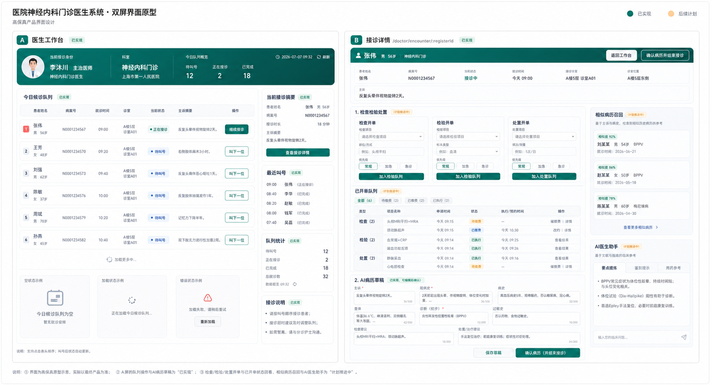

# 设计图留档

更新时间：2026-07-10。

本文档集中保留项目关键界面的设计图，用于阶段汇报、答辩说明和设计演进追溯。图片反映生成时的设计意图，具体页面实现、接口状态和验收结论以当前主文档为准。非空医生队列图表尚待真实当日数据补验，原因与验收方式见 [问题记录第 24 项](./问题记录.md#24-固定日期演示数据导致今日队列为空)。

## 1. 医生端工作台改版方向

图稿用于记录医生端工作台和接诊详情的整体布局方向：左侧突出候诊队列与接诊节奏，右侧组织接诊摘要、检查检验处置和 AI 辅助信息。实际医生工作台顶部的挂号状态环图与分时段条形图设计、数据口径和验收记录见 [医生工作台挂号可视化改版计划 v2](./doctor-workbench-registration-visual-plan-v2.md)。

## 2. 患者端首页概念图

图稿用于记录患者端移动优先、蓝白医疗视觉、首页服务入口和就诊流程引导的设计方向。当前路由、页面状态和实现切片见 [frontend-plan.md](./frontend-plan.md)。

## 3. 患者端页面概念图

图稿用于记录患者端挂号、候诊、记录和个人中心等页面的统一视觉语言与信息层级。图中内容不等同于当前接口实现；业务边界和最新状态以 [项目规划.md](./项目规划.md) 为准。

## 使用说明

- 设计图用于说明布局、视觉方向和信息层级，不作为真实患者数据或最终界面逐像素依据。
- 汇报引用时，应同时说明对应页面的实现状态与尚未完成边界。
- 设计更新后保留旧图并新增日期明确的版本，避免覆盖历史设计证据。
